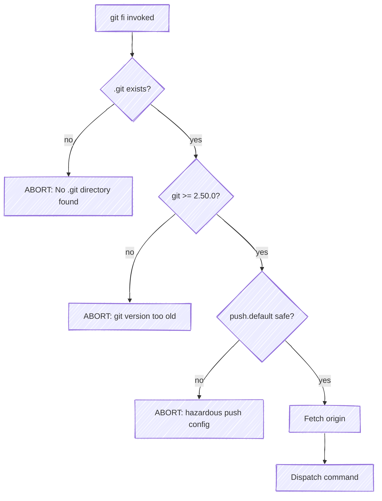
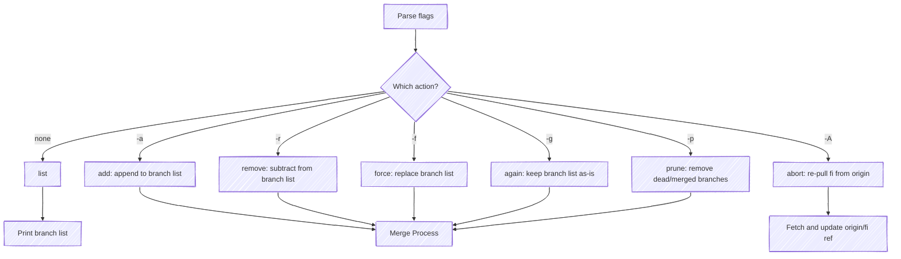
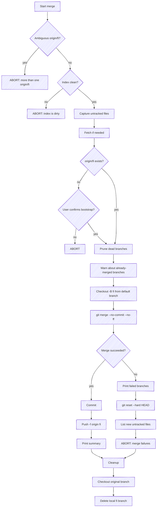

# git-fi Specification (DRAFT)

## Overview

git-fi is a git plugin that maintains a temporary integration branch named `fi`. It merges multiple in-progress feature branches together so teams can detect merge conflicts early and test features in collaboration rather than isolation.

The `fi` branch is ephemeral — it is force-pushed on every operation and should never be manually committed to.

## Invocation

```
git fi [options] [<branch>...]
```

git-fi is invoked as a git subcommand. It must be run from the repository root (a `.git` directory must exist in the current working directory).

## Pre-flight Checks

Before any command executes, git-fi runs the following pre-flight checks:

1. `PF-01` If no `.git` directory exists in the current working directory, then git-fi shall abort with: `No .git directory found.`
2. `PF-02` If the git version is below 2.50.0, then git-fi shall abort with: `git version X is too old, please upgrade to at least 2.50.0.`
3. `PF-03` If `git config push.default` is `upstream` or `tracking`, then git-fi shall abort with: `Your default git push config is set to a hazardous option.`
4. `PF-04` git-fi shall run `git fetch --quiet --prune origin` once per invocation, memoizing to avoid redundant fetches.



## Global Options

| ID       | Flag        | Short | Description                                                               |
|----------|-------------|-------|---------------------------------------------------------------------------|
| `OPT-01` | `--debug`   | `-d`  | Print git commands as they execute; remove `--quiet` from git invocations |
| `OPT-02` | `--bare`    | `-b`  | Machine-readable output (space-separated branch names for list)           |
| `OPT-03` | `--json`    | `-j`  | Structured JSON output for `list` (see [JSON Output](#json-output))       |
| `OPT-04` | `--select`  | `-s`  | Interactive branch picker for `--add` / `--remove` (requires TTY)         |
| `OPT-05` | `--version` | `-V`  | Print the current version string to stdout and exit 0                     |
| `OPT-06` | `--help`    | `-h`  | Print a usage summary to stdout and exit 0; direct to the public wiki for full details |

`OPT-07` If `--bare` is specified with any action other than `list`, then git-fi shall abort with an error.

## Terminal Output

### General

`TRM-01` When the word `fi` appears in console output (messages, headers, prompts), git-fi shall render it as a code-styled token — e.g., using backtick quoting in markdown-aware terminals, or bold/highlighted formatting in TTY output.

### Color

`TRM-02` The system shall use only the base 8 ANSI foreground colors (and their bold variants). The system shall not use 256-color codes, RGB escape sequences, or background colors — these break across terminal themes. Semantic ANSI colors adapt to the user's theme automatically (e.g., "cyan" in Solarized Dark differs from "cyan" in Dracula, but both are readable).

`TRM-03` The system shall use bold, dim, underline, and other text attributes for structural emphasis so meaning is not conveyed by color alone.

`TRM-04` When stdout is a TTY, git-fi shall colorize output using these assignments:

- **Branch names** — cyan; green when highlighted on success
- **Action annotations** (`<- new`, `<- merging`, etc.) — dim; green bold on success
- **Success verb** (`added`, `removed`, etc.) — green, bold
- **Failure indicator** (`failed`) — red, bold
- **Warnings** (dead branches, already-merged) — yellow
- **Errors** and abort messages — red, bold
- **Bullet markers** (` * `) — dim

`TRM-05` When stdout is not a TTY, `--bare` or `--json` is specified, or the `NO_COLOR` environment variable is set, the system shall disable all color output (see [no-color.org](https://no-color.org)).

### Progress

`TRM-06` While a long-running operation is in progress, git-fi shall display progress on stderr so it does not interfere with stdout:

- **Fetch** — `Fetching from origin...` with a spinner
- **Merge** — `Merging N branches...`
- **GitLab API** — `Fetching CI status...` with a spinner

`TRM-07` When stderr is not a TTY, or when `--bare` or `--json` is specified, git-fi shall suppress progress output.

`TRM-08` When a mutation operation is in progress, git-fi shall update each action annotation (`<- ...`) in-place on a TTY using cursor movement, progressing through a sequence of states where each state fully replaces the previous annotation text. When stdout is not a TTY, git-fi shall skip the in-place updates and print `Done!` to stderr instead.

**Initial state** — displayed when the branch list is first printed:

| Action   | Initial annotation |
|----------|--------------------|
| add      | `<- new`           |
| remove   | `<- removing`      |
| force    | `<- replacing`     |
| again    | `<- re-merging`    |
| prune    | `<- pruning`       |

**Intermediate states** — each overwrites the annotation in-place as the operation progresses:

1. `<- merging` — before `git merge` (skipped when no branches to merge)
2. `<- committing` — before `git commit`
3. `<- pushing` — before `git push`

**Terminal states** — the final annotation, styled green bold on success or red bold on failure:

| Action   | Success annotation | Failure annotation |
|----------|--------------------|--------------------|
| add      | `<- added`         | `<- failed`        |
| remove   | `<- removed`       | `<- failed`        |
| force    | `<- replaced`      | `<- failed`        |
| again    | `<- re-merged`     | `<- failed`        |
| prune    | `<- pruned`        | `<- failed`        |

## Commands

Exactly one action flag may be specified. If no action and no branches are given, the default action is `list`.



| Flag | Short | Action |
|------|-------|--------|
| _(none)_ | | List branches currently in fi |
| `--add` | `-a` | Add branch(es) to fi |
| `--remove` | `-r` | Remove branch(es) from fi |
| `--force` | `-f` | Replace fi contents with only the given branch(es) |
| `--again` | `-g` | Re-merge all branches currently in fi |
| `--prune` | `-p` | Remove dead and already-merged branches from fi |
| `--abort` | `-A` | Re-pull fi from origin (discard local state) |

### Branch Name Resolution

- `BR-01` When a branch name does not start with `origin/`, git-fi shall prepend `origin/`.
- `BR-02` When `--add` or `--remove` is specified with no branch name and `--select` is not set, git-fi shall default to the current branch. If the current branch is `main`, `master`, `fi`, or `HEAD`, then git-fi shall abort with: `No branch was specified.`
- `BR-03` When `--add` or `--force` is specified, git-fi shall verify all branches exist on origin. If any branches are missing, then git-fi shall print the missing branches and abort:
  ```
  the following branches do not exist on origin:
   * no-such-branch
  ```
- `BR-04` When `--remove` is specified, git-fi shall not perform an existence check (removing a non-existent branch is a no-op).

### list (default)

`LS-01` If `origin/fi` does not exist, then git-fi shall abort with: `there is no fi branch for this project.`

**Behavior:**

- `LS-02` When `--bare` is specified, git-fi shall print space-separated branch names (without `origin/` prefix) to stdout.
- `LS-03` When listing in normal mode, git-fi shall print a tabular list of branch names (without `origin/` prefix). Where `GITLAB_ACCESS_TOKEN` is set, git-fi shall also show CI status, last commit date, and author (see [GitLab CI Status](#gitlab-ci-status)), followed by the fi integration pipeline ID and status (see GL-05).

**Output (normal):**

```
Branch
──────────────
feature-a
feature-b

For enhanced CI status, export GITLAB_ACCESS_TOKEN. To suppress this hint, export GIT_FI_NO_HINTS.
```

**Output (bare):**

```
feature-a feature-b
```

`LS-04` When `GITLAB_ACCESS_TOKEN` is set, `GIT_FI_NO_HINTS` is set, or `--bare` or `--json` is specified, git-fi shall suppress the hint line.

`LS-05` When branch names are given with no action flag, git-fi shall treat them as a single regex pattern that filters the `list` output to matching branches. If more than one pattern is given, then git-fi shall abort.

`LS-06` git-fi shall display branches in insertion order — the order in which they were originally added. git-fi shall not apply alphabetical or date-based sorting.

`LS-07` When fi contains no enlisted branches, git-fi shall omit the table entirely (no headers or separator are printed). The `fi:` pipeline line (GL-05) shall still be shown if applicable.

### Interactive Branch Selection (`--select`)

`SEL-01` When `--select` is combined with `--add`, git-fi shall display an interactive multi-select picker showing all remote branches not already in fi (excluding the default branch and `origin/fi`). When the user confirms, git-fi shall continue with the normal add flow.

`SEL-02` When `--select` is combined with `--remove`, git-fi shall display an interactive multi-select picker showing branches currently in fi. When the user confirms, git-fi shall continue with the normal remove flow.

`SEL-03` If `--select` is specified and a TTY is not available on both stdin and stdout, then git-fi shall abort.

`SEL-04` If `--select` is combined with `--force`, `--again`, or `--list`, then git-fi shall abort.

`SEL-05` When the user confirms the picker with no branches selected, git-fi shall exit 0 without merging.

`SEL-06` When `--select` is used alone (no `--add` / `--remove`), git-fi shall display a unified multi-select picker showing all remote `--no-merged` branches from the last 3 months (sorted by committer date, most recent first), plus any branches currently in fi. Current fi branches shall be pre-selected (toggled on). When the user confirms, git-fi shall compute the diff between the current fi set and the selected set to determine which branches to add and remove, then continue with the normal merge flow.

### add / `--add` / `-a`

`AD-01` If the working index is not clean, then git-fi shall abort.

**Process:**

1. `AD-02` git-fi shall get the current branch list from fi (via commit message parsing — see [Branch List Storage](#branch-list-storage)).
2. `AD-03` git-fi shall append new branches and deduplicate.
3. `AD-04` git-fi shall run the merge process with the full list.

**Output:**

```
fi:
 * feature-a
 * feature-b
 * feature-c  <- added
```

### remove / `--remove` / `-r`

`CMD-01` When `--remove` is specified, git-fi shall remove the specified branches from the current fi branch list and run the merge process with the remaining list.

**Output:** Removed branches are shown dimmed with `<- removing` annotation.

`CMD-02` When removing a branch that is not in fi, git-fi shall silently ignore it.

### force / `--force` / `-f`

`CMD-03` When `--force` is specified, git-fi shall replace the entire branch list with only the specified branches.

**Output:** Branch list followed by `<- replacing` footer.

`CMD-04` When `--force` is specified with no branches, git-fi shall remove all features (empty fi).

### again / `--again` / `-g`

`CMD-05` When `--again` is specified, git-fi shall re-merge all branches currently in fi. If branch arguments are provided, then git-fi shall abort with `--again does not accept branch names`.

**Output:** Branch list followed by `<- re-merging` footer.

### prune / `--prune` / `-p`

`CMD-06` When `--prune` is specified, git-fi shall remove branches from fi that no longer exist on origin (dead) or that have already been merged into the default branch. If branch arguments are provided, then git-fi shall abort with `--prune does not accept branch names`.

`CMD-07` If no branches qualify for pruning, then git-fi shall print `Nothing to prune.` and exit without merging.

**Output:** Branch list followed by `<- pruning` footer.

### abort / `--abort` / `-A`

`CMD-08` When `--abort` is specified, git-fi shall re-pull `origin/fi` from origin, discarding any local ref state. If branch arguments are provided, then git-fi shall abort with `--abort does not accept branch names`.

`CMD-09` If `origin/fi` does not exist when `--abort` is specified, then git-fi shall abort with `origin/fi does not exist — nothing to re-pull`.

## Merge Process

The core merge operation that `--add`, `--remove`, `--force`, and `--again` all converge on.



### Flow

1. `MG-01` If more than one `origin/fi` ref exists, then git-fi shall abort with: `There is more than one origin/fi!`
2. `MG-02` If uncommitted changes exist, then git-fi shall abort with `Your index is dirty`.
3. `MG-03` git-fi shall capture a snapshot of untracked files via `git ls-files --other --exclude-standard`.
4. `MG-04` git-fi shall run `git fetch --quiet --prune origin` (if not already done).
5. `MG-05` If no `origin/fi` ref exists after fetch, then git-fi shall display a bootstrap confirmation prompt. This prompt shall always be shown and cannot be suppressed. If the user does not enter `y`, then git-fi shall abort. Example:

   ```text
   Bootstrap path/to/repo with fi capability?
   See: https://github.com/gettyimages/git-fi

   y - yes
   anything else: no

   Are you sure?
   ```

   `MG-14` git-fi shall include a `See:` line in the bootstrap prompt (MG-05) linking to the git-fi project README (`https://github.com/gettyimages/git-fi`) so users unfamiliar with fi can understand the tool before confirming.

6. `MG-06` When branches in the list no longer exist on origin, git-fi shall remove them and warn on stderr: `Ignoring branches that no longer exist:`
7. `MG-07` When a branch is already an ancestor of the default branch, git-fi shall warn on stderr: `X already in main`
8. `MG-08` git-fi shall create a temporary fi branch via `git checkout --quiet -B fi origin/<default_branch>`.
9. `MG-09` git-fi shall merge via `git merge --no-commit --quiet --no-ff --no-edit <branch1> <branch2> ...`
10. `MG-10` When the merge succeeds, git-fi shall:
    - Commit (see [Commit Message](#commit-message)) — update annotation to `<- committing`.
    - Push: `git push --no-verify -f origin fi` — update annotation to `<- pushing`.
    - Finalize annotation line(s) with the action's terminal success state (see TRM-08).
    - Print the branch list table (identical to `list` output, including the fi pipeline per GL-05) so the user sees the final state without running a separate command.
11. `MG-11` When the merge fails, git-fi shall:
    - Abort the failed merge (leave the working tree clean).
    - Print failed branch names.
    - List any new untracked files created during the failed merge, with suggested `rm` commands.
    - Abort with: `Aborted due to merge failures`
12. `MG-12` After the merge process completes (success or failure), git-fi shall:
    - Restore the user to their original branch.
    - Delete the local temporary `fi` branch.

### Commit Message

The commit message uses the format `(branch-a, branch-b)@[shorthash]` where `shorthash` is the short hash of the default branch tip. This format is parsed by BL-01 for round-tripping (see [Branch List Storage](#branch-list-storage)).

**CI mode** — see [CI Integration](#ci-integration) for the commit message format when running in a pipeline.

### Success Output

The annotation line(s) update in-place to show the terminal state (see TRM-08), followed by the full branch list table (see LS-03):

```
fi:
 * feature-a
 * feature-b  <- added
fi: #12345 ⏳

Branch    │ Date       │ Author │ Pipeline
──────────┼────────────┼────────┼──────────
feature-a │ 2026-03-30 │ Alice  │ 11111 ✅
feature-b │ 2026-03-30 │ Bob    │ 22222 ✅
```

If `GITLAB_ACCESS_TOKEN` is not set, the table has only a Branch column (no CI data). The `fi:` pipeline line (GL-05) is also omitted.

### Failure Output

```
Failed trying to merge branch(es):

 * feature-a
 * feature-b

Aborted due to merge failures
```

If new untracked files were created during the failed merge:

```
Some extra untracked files have been left as a result of the failed merge(s):

 * conflict-file.txt

You can delete these by running:
  rm "conflict-file.txt"
```

## Branch List Storage

`BL-01` git-fi shall store the list of branches merged into fi in the fi branch's commit message using the format `(branch-a, branch-b)@[shorthash]`. When no branches are present, git-fi shall use the format `@[shorthash]`. Branch names shall be stored without the `origin/` prefix.

`BL-02` When reading the branch list, git-fi shall parse the commit message of `origin/fi` using the regex pattern `\(([^)]+)\)@\[` and split on commas. git-fi shall prepend the `origin/` prefix during parsing and filter out the default branch.

### Legacy Commit Message Format

`BL-03` A previous version of the tool used the standard git merge commit message format:

```text
Merge remote-tracking branches 'origin/86b8nre6n_New_endpoint_to_complete_cko_flow_order', 'origin/Try-fix_get_api_orders_for_company' and 'origin/prorated-sub-checkout-successful' into fi
```

When parsing the fi branch's commit message, if this legacy format is detected — a message matching `Merge remote-tracking branch(es) 'origin/<branch>'...into fi` — git-fi shall extract branch names from the quoted `'origin/<name>'` segments and shall continue using the legacy format for subsequent commit messages in the same repository. When the preferred brief format (BL-01) is detected, git-fi shall use that instead. When no `origin/fi` exists (bootstrap), git-fi shall use the preferred brief format.

## Default Branch Detection

`BR-05` git-fi shall determine the mainline branch for the repository (typically `main` or `master`) via `git symbolic-ref refs/remotes/origin/HEAD`, extracting the last path component. If the symbolic ref is not set, then git-fi shall fall back to probing `origin/main` and `origin/master`.

## Formatting Helpers

- `FMT-01` git-fi shall render bullet lists with each item prefixed with ` * `. When the list is empty, git-fi shall render `<Nothing>`.
- `FMT-02` git-fi shall update action annotations in-place through initial, intermediate, and terminal states as defined in TRM-08.

## GitLab CI Status

`GL-01` When `GITLAB_ACCESS_TOKEN` is set, git-fi shall fetch pipeline status for each branch from the GitLab API and display a table with columns: Branch, Date, Author, Pipeline. git-fi shall show status with emoji indicators:

| Emoji | Status |
| --- | --- |
| ✅ | SUCCESS |
| ❌ | FAILED |
| ⏰ | TIMEOUT |
| ⏳ | RUNNING / PENDING |
| ➖ | MISSING |
| ⏭️ | SKIPPED |

`GL-02` git-fi shall parse the origin URL to extract the GitLab project path. git-fi shall support both SSH (`git@gitlab.example.com:path/to/repo`) and HTTPS (`https://gitlab.example.com/path/to/repo`) formats, with optional `.git` suffix removed.

`GL-03` If a GitLab API call fails with a non-404 HTTP error, then git-fi shall abort with a clear error message explaining what failed and suggest unsetting `GITLAB_ACCESS_TOKEN` to use basic mode. When the API returns HTTP 404 for an individual branch (e.g. a deleted branch), git-fi shall treat it as `missing` status rather than a fatal error.

`GL-04` When a GitLab project is detected, git-fi shall render branch names and pipeline IDs as clickable terminal hyperlinks (OSC 8) pointing to the corresponding GitLab URLs.

`GL-05` **Pipeline link after merge:** When `GITLAB_ACCESS_TOKEN` is set and a merge operation succeeds, git-fi shall fetch the pipeline for the `fi` branch matching the just-pushed SHA and display it as `fi: #<id> <emoji>`, where `#<id>` is a clickable hyperlink (OSC 8) and the emoji uses the same set as GL-01. The `fi:` prefix distinguishes this integration pipeline from the per-branch pipelines shown in the list table. If the pipeline has not yet been created by GitLab, git-fi retries up to 4 times with 1.5 s delays. If the API call fails or no matching pipeline appears, the line is silently omitted.

`GL-06` When the GitLab commits API returns HTTP 404 for a branch in the CI table, git-fi shall display a warning indicator next to the branch name to signal the branch no longer exists on the remote.

## CI Integration

`MG-13` When git-fi runs inside a GitLab CI pipeline (detected via the `CI` environment variable), git-fi shall include pipeline context in the commit message for traceability:

```text
Re-merge fi branch triggered by build <CI_PIPELINE_ID> due to commit on <CI_COMMIT_REF_NAME>. Was originally: --- <previous_fi_commit_message>

(branch-a, branch-b)@[shorthash]
```

The trailing signature line ensures that BL-01 round-tripping works even when the previous commit message is embedded in the `Was originally:` preamble.

| Variable             | Purpose                                                        |
|----------------------|----------------------------------------------------------------|
| `CI`                 | When set, enables CI-aware commit messages                     |
| `CI_PIPELINE_ID`     | Pipeline number included in commit message                     |
| `CI_COMMIT_REF_NAME` | Branch that triggered the pipeline, included in commit message |

These are standard [GitLab predefined variables](https://docs.gitlab.com/ci/variables/predefined_variables/) and do not need to be configured manually.

## Environment Variables

| Variable | Purpose |
|----------|---------|
| `GITLAB_ACCESS_TOKEN` | When set (and non-empty), enables GitLab CI status display in `list`. If set to an empty string, abort with a clear error. |
| `GIT_FI_NO_HINTS` | When set, suppresses the hint about `GITLAB_ACCESS_TOKEN` |
| `NO_COLOR` | When set, disables all color output ([no-color.org](https://no-color.org)) |

## JSON Output

`JS-01` If `--json` is specified with any action other than `list`, then git-fi shall abort with an error.

`JS-02` When `--json` is specified, git-fi shall write a single JSON object to stdout. git-fi shall direct all human-readable output (progress, hints, warnings) to stderr only.

```json
{
  "command": "list",
  "branches": ["feature-a", "feature-b"],
  "ci": [
    {"branch": "feature-a", "status": "success", "author": "Name", "date": "2026-03-13"},
    {"branch": "feature-b", "status": "failed", "author": "Name", "date": "2026-03-12"}
  ]
}
```

`JS-03` Where `GITLAB_ACCESS_TOKEN` is set, git-fi shall include a `ci` array in the JSON output. When the variable is not set, git-fi shall omit the `ci` array.

## Exit Codes

- `EX-01` When an operation completes successfully, git-fi shall exit with code `0`.
- `EX-02` When an operation fails, git-fi shall exit with a non-zero code.

## Platform Compatibility

- `PLT-01` git-fi shall suppress stderr from git commands. When `--debug` is set or `show_errors` is explicitly requested, git-fi shall allow stderr output.
