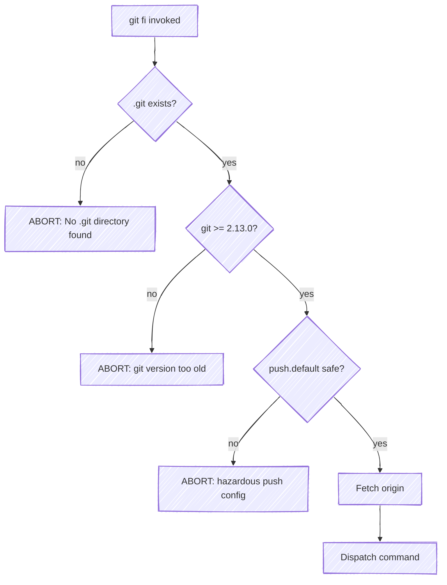
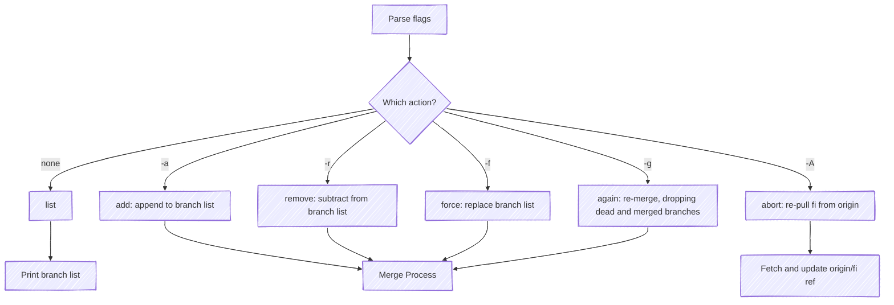
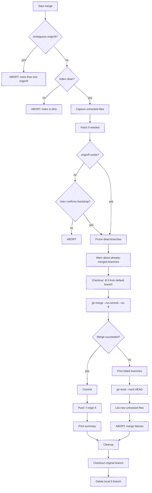

# git-fi Specification

## Overview

git-fi is a git plugin that maintains a temporary integration branch named `fi`. It merges multiple in-progress feature branches together so teams can detect merge conflicts early and test features in collaboration rather than isolation.

The `fi` branch is ephemeral — it is force-pushed on every operation and should never be manually committed to.

## Invocation

```
git fi [options] [<branch>...]
```

git-fi is invoked as a git subcommand. It must be run from the repository root (a `.git` directory must exist in the current working directory).

## Pre-flight Checks

Before any command executes, git-fi runs the following pre-flight checks:

1. `PF-01` If no `.git` directory exists in the current working directory, then git-fi shall abort with `No .git directory found.` followed by a line pointing to the documentation site (`https://gettyimages.github.io/git-fi/#/`) for newcomers.
2. `PF-02` If the git version is below 2.13.0, then git-fi shall abort with: `git version X is too old, please upgrade to at least 2.13.0.` The floor is set by `git branch -r --format=...`, which the batched branch listing depends on (`PRF-01`) and which git gained in 2.13.0; every other git invocation git-fi makes predates it. An implementation that reaches the same listing another way may state its own floor here.
3. `PF-03` If `git config push.default` is `upstream` or `tracking`, then git-fi shall abort with: `Your default git push config is set to a hazardous option.`
4. `PF-04` git-fi shall run `git fetch --quiet --prune origin` once per invocation, memoizing to avoid redundant fetches.
5. `PF-05` Where `GIT_FI_NO_FETCH` is set, git-fi shall skip the fetch (`PF-04`) on read-only operations (`list`) and operate on the already-fetched remote-tracking refs. Shell completion sets this so tab-completion stays offline. Mutating operations always fetch regardless, so an integration merge never builds on stale refs. (All environment variables are catalogued in [Environment Variables](#environment-variables).)


```mermaid
%%{ init: { 'look': 'handDrawn' } }%%
flowchart TD
    A[git fi invoked] --> B{.git exists?}
    B -- no --> B1[ABORT: No .git directory found]
    B -- yes --> C{git >= 2.13.0?}
    C -- no --> C1[ABORT: git version too old]
    C -- yes --> D{push.default safe?}
    D -- no --> D1[ABORT: hazardous push config]
    D -- yes --> E[Fetch origin]
    E --> F[Dispatch command]
```

## Global Options

| ID       | Flag        | Short | Description                                                               |
|----------|-------------|-------|---------------------------------------------------------------------------|
| `OPT-01` | `--debug`   | `-d`  | Print git commands as they execute; remove `--quiet` from git invocations |
| `OPT-02` | `--bare`    | `-b`  | Machine-readable output: space-separated branch names (any action, `OPT-08`) |
| `OPT-03` | `--json`    | `-j`  | Structured JSON output (any action, `OPT-08`; see [JSON Output](#json-output)) |
| `OPT-04` | `--select`  | `-s`  | Interactive branch picker for `--add` / `--remove` (requires TTY)         |
| `OPT-05` | `--version` | `-V`  | Print the current version string to stdout and exit 0                     |
| `OPT-06` | `--help`    | `-h`  | Print a usage summary to stdout and exit 0; direct to the documentation site for full details |
| `OPT-07` | `--yes`     | `-y`  | Bootstrap `fi` without the confirmation prompt (see `MG-15`); intended for CI and scripts |

`OPT-08` `--bare` and `--json` select an output format rather than a command, so git-fi shall accept either with any action. When an action other than `list` completes, git-fi shall render the resulting branch list in the requested format, exactly as `list` would (`LS-02`, `JS-01`). git-fi shall keep stdout free of human-readable output in these modes: the merge display and its annotations are suppressed (`TRM-07`) and any diagnostics go to stderr (`JS-01`).

`OPT-09` If `--select` is combined with `--bare` or `--json`, then git-fi shall abort with `--select cannot be combined with <flag>`. The picker draws its interactive UI on stdout, which is the stream carrying machine output, so the two cannot both use it.

## Help & Documentation

`HLP-01` When `help` is given as the sole argument, git-fi shall print the usage summary to stdout and exit 0. (git routes the `--help` flag to `man git-fi`; the bare `help` word and `-h` reach git-fi directly, providing a man-independent path to the summary.)

`HLP-02` git-fi shall ship a man page (`git-fi.1`, declared via the package `man` field) so that `git fi --help` — which git routes to `man git-fi` — displays the manual.

## Shell Completion

`CMP-01` git-fi shall provide shell completion for bash and zsh, discovered by git for the `git fi` subcommand, completing the action/option flags and branch-name arguments.

`CMP-02` git-fi shall provide completion for both providers that dispatch `git fi`: zsh's built-in `_git` (which calls `_git-fi`) and git's own completion wrapper (which calls `_git_fi` under ksh emulation, in bash and in zsh). The `_git_fi` completer shall read the command line from git's `$words`/`$cur` — not bash's `COMP_WORDS`, which git's zsh wrapper leaves unset — so action-aware completion (`CMP-03`) works under both shells. Each file on the zsh fpath shall complete on the first `<TAB>` in a shell: zsh's autoload runs the file as the function body, so a file that only defines its completer leaves that first tab doing nothing.

`CMP-03` At the command position (no action flag yet), git-fi's completion shall offer the action/option flags and subcommands, not a branch list. When completing a branch argument, it shall offer: for `--add`, origin branches not already in fi (excluding `HEAD`, `fi`, and the default branch); for `--remove`, only branches currently in fi.

`CMP-04` git-fi's completion shall determine fi membership without a network fetch (via `GIT_FI_NO_FETCH`, `PF-05`), so completion stays offline and fast.

`CMP-05` git-fi shall provide an `install-completions [bash|zsh|zsh-git]` subcommand that prints a completion script to stdout — for sourcing (e.g. `source <(git fi install-completions bash)`) or for writing onto the zsh fpath. It shall print one target per invocation: `bash` the git-completion-format script, `zsh` the `_git-fi` file for zsh's built-in `_git`, and `zsh-git` the `_git_fi` file for git's own completion wrapper. With no argument it shall detect `bash` or `zsh` from `$SHELL`; every provider named by `CMP-02` shall be installable through this subcommand, without copying files out of the package directory. If no supported target is given or detected, then git-fi shall abort with usage guidance.

`CMP-06` `install-completions --write <dir>` shall write the zsh completion files into `<dir>`, creating it if absent, and shall name each path written. With no target it shall write both zsh files, so one command covers whichever provider (`CMP-02`) the user's git install dispatches to; with `zsh` or `zsh-git` it shall write that one file, and with `bash` it shall abort — bash completion is sourced from an rc file and has no fpath to land on. It shall report reloading completions as a step for the user to run. git-fi shall not edit the user's rc files or write to any directory the user did not name; when `<dir>` cannot be created or written, it shall abort naming the path and how to install into a directory the user owns.

`CMP-07` Installing git-fi globally shall install the zsh completion files, so `git fi <TAB>` works without a further step. They shall go under npm's own prefix (`<prefix>/share/zsh/site-functions`, the directory Homebrew and `/usr/local` zsh setups carry on their fpath, and the prefix npm already links the man page into); git-fi shall write nothing outside that prefix and shall not edit the user's rc files. A local (non-global) install shall install nothing. A prefix that cannot be resolved or written shall not fail the install: git-fi shall report the `CMP-06` command that finishes the job and exit 0.

## Terminal Output

### General

`TRM-01` When the word `fi` appears in console output (messages, headers, prompts), git-fi shall render it as a code-styled token — e.g., using backtick quoting in markdown-aware terminals, or bold/highlighted formatting in TTY output.

### Color

`TRM-02` The system shall use only the base 8 ANSI foreground colors (and their bold variants). The system shall not use 256-color codes, RGB escape sequences, or background colors — these break across terminal themes. Semantic ANSI colors adapt to the user's theme automatically (e.g., "cyan" in Solarized Dark differs from "cyan" in Dracula, but both are readable).

`TRM-03` The system shall use bold, dim, underline, and other text attributes for structural emphasis so meaning is not conveyed by color alone.

`TRM-04` When stdout is a TTY, git-fi shall colorize output using these assignments:

- **Branch names** — cyan; green when highlighted on success
- **Action annotations** (`<- new`, `<- merging`, etc.) — dim; green bold on success
- **Success verb** (`added`, `removed`, etc.) — green, bold
- **Failure indicator** (`failed`) — red, bold
- **Warnings** (dead branches, already-merged) — yellow
- **Errors** and abort messages — red, bold
- **Bullet markers** (` * `) — dim

`TRM-05` When stdout is not a TTY, `--bare` or `--json` is specified, or the `NO_COLOR` environment variable is set, the system shall disable all color output (see [no-color.org](https://no-color.org)).

### Progress

`TRM-06` While a long-running operation is in progress, git-fi shall display progress on stderr so it does not interfere with stdout:

- **Fetch** — `Fetching from origin...` with a spinner
- **Merge** — `Merging N branches...`
- **GitLab API** — `Fetching CI status...` with a spinner

`TRM-07` When stderr is not a TTY, or when `--bare` or `--json` is specified, git-fi shall suppress progress output.

`TRM-08` When a mutation operation is in progress and stdout is a TTY, git-fi shall print the branch display and update each action annotation (`<- ...`) in-place using cursor movement, progressing through a sequence of states where each state fully replaces the previous annotation text.

**Initial state** — displayed when the branch list is first printed:

| Action   | Initial annotation |
|----------|--------------------|
| add      | `<- new`           |
| remove   | `<- removing`      |
| force    | `<- replacing`     |
| again    | `<- re-merging`    |

**Intermediate states** — each overwrites the annotation in-place as the operation progresses:

1. `<- merging` — before `git merge` (skipped when no branches to merge)
2. `<- committing` — before `git commit`
3. `<- pushing` — before `git push`

**Terminal states** — the final annotation, styled green bold on success or red bold on failure:

| Action   | Success annotation | Failure annotation |
|----------|--------------------|--------------------|
| add      | `<- added`         | `<- failed`        |
| remove   | `<- removed`       | `<- failed`        |
| force    | `<- replaced`      | `<- failed`        |
| again    | `<- re-merged`     | `<- failed`        |

`TRM-09` When stdout is not a TTY, git-fi shall print neither the branch display nor any annotation from `TRM-08`, and on success shall state the outcome once as `<verb> fi`:

| Action | Off-TTY outcome   |
|--------|-------------------|
| add    | `added to fi`     |
| remove | `removed from fi` |
| force  | `replaced fi`     |
| again  | `re-merged fi`    |

In human mode this line goes to stdout, ahead of the branch list, so a reader cannot see the two reordered; under `--bare` or `--json`, stdout is machine-only (`JS-02`) and it goes to stderr. On failure there is no outcome line: the `MG-11` diagnostics carry it.

The display exists to be a canvas for the in-place rewrites, and the branch list it shows is repeated by the table that follows (`LS-03`). Printed where the rewrites cannot happen, it leaves the *initial* verb (`<- re-merging`, for an operation that finished) as the log's only statement of the outcome.

`TRM-10` Pipeline status is carried by an emoji (`GL-01`, `GL-05`) and by nothing else in the same cell, so under the `TRM-05` conditions that disable color — stdout not a TTY, `--bare`, `--json`, or `NO_COLOR` — git-fi shall print the status as a word instead:

| Status | Emoji | Word |
| --- | --- | --- |
| SUCCESS | ✅ | `success` |
| FAILED | ❌ | `failed` |
| TIMEOUT | ⏰ | `timed out` |
| RUNNING | ⏳ | `running` |
| PENDING | ⏳ | `pending` |
| NO PIPELINE | ➖ | `none` |
| SKIPPED | ⏭️ | `skipped` |

A log read as plain text is the case this covers: a CI job log or a piped run, where the glyph is the sole carrier of a fact the reader needs and `TRM-03` already rules out conveying meaning by decoration alone.

## Commands

Exactly one action flag may be specified. If no action and no branches are given, the default action is `list`.


```mermaid
%%{ init: { 'look': 'handDrawn' } }%%
flowchart TD
    A[Parse flags] --> B{Which action?}
    B -- none --> L[list]
    B -- -a --> ADD[add: append to branch list]
    B -- -r --> REM[remove: subtract from branch list]
    B -- -f --> FRC[force: replace branch list]
    B -- -g --> AGN[again: re-merge, dropping dead and merged branches]
    B -- -A --> ABT[abort: re-pull fi from origin]

    ADD --> M[Merge Process]
    REM --> M
    FRC --> M
    AGN --> M

    L --> OUT[Print branch list]
    ABT --> PULL[Fetch and update origin/fi ref]
```

| Flag | Short | Action |
|------|-------|--------|
| _(none)_ | | List branches currently in fi |
| `--add` | `-a` | Add branch(es) to fi |
| `--remove` | `-r` | Remove branch(es) from fi |
| `--force` | `-f` | Replace fi contents with only the given branch(es) |
| `--again` | `-g` | Re-merge fi, dropping dead and already-merged branches |
| `--abort` | `-A` | Re-pull fi from origin (discard local state) |

### Branch Name Resolution

- `BR-01` When a branch name does not start with `origin/`, git-fi shall prepend `origin/`.
- `BR-02` When `--add` or `--remove` is specified with no branch name and `--select` is not set, git-fi shall default to the current branch. If the current branch is `main`, `master`, `fi`, or `HEAD`, then git-fi shall abort with: `No branch was specified.`
- `BR-03` When `--add` or `--force` is specified, git-fi shall verify all branches exist on origin. If any branches are missing, then git-fi shall print the missing branches and abort:
  ```
  the following branches do not exist on origin:
   * no-such-branch
  ```
- `BR-04` When `--remove` is specified, git-fi shall not perform an existence check (removing a non-existent branch is a no-op).

### list (default)

`LS-01` If `origin/fi` does not exist, then git-fi shall abort with `there is no fi branch for this project.` followed by a line explaining how to bootstrap it (`git fi --add <branch>`, or `--yes` in CI) and a link to the documentation site.

**Behavior:**

- `LS-02` When `--bare` is specified, git-fi shall print space-separated branch names (without `origin/` prefix) to stdout.
- `LS-03` When listing in normal mode, git-fi shall print a tabular list of branch names (without `origin/` prefix). Where `GITLAB_ACCESS_TOKEN` is set, git-fi shall also show CI status, last commit date, and author (see [GitLab CI Status](#gitlab-ci-status)), followed by the fi integration pipeline ID and status (see GL-05).

**Output (normal):**

```
Branch
──────────────
feature-a
feature-b

For enhanced CI status, export GITLAB_ACCESS_TOKEN. To suppress this hint, export GIT_FI_NO_HINTS.
```

**Output (bare):**

```
feature-a feature-b
```

`LS-04` When `GITLAB_ACCESS_TOKEN` is set, `GIT_FI_NO_HINTS` is set, or `--bare` or `--json` is specified, git-fi shall suppress the hint line.

`LS-05` When branch names are given with no action flag, git-fi shall treat them as a single regex pattern that filters the `list` output to matching branches. If more than one pattern is given, then git-fi shall abort.

`LS-06` git-fi shall display branches in insertion order — the order in which they were originally added. git-fi shall not apply alphabetical or date-based sorting.

`LS-07` When fi contains no enlisted branches, git-fi shall omit the table entirely (no headers or separator are printed). The `fi:` pipeline line (GL-05) shall still be shown if applicable.

### Interactive Branch Selection (`--select`)

`SEL-01` When `--select` is combined with `--add`, git-fi shall display an interactive multi-select picker showing all remote branches not already in fi (excluding the default branch, `origin/fi`, and the `origin/HEAD` symbolic ref). When the user confirms, git-fi shall continue with the normal add flow.

`SEL-02` When `--select` is combined with `--remove`, git-fi shall display an interactive multi-select picker showing branches currently in fi. When the user confirms, git-fi shall continue with the normal remove flow.

`SEL-03` If `--select` is specified and a TTY is not available on both stdin and stdout, then git-fi shall abort.

`SEL-04` If `--select` is combined with `--force`, `--again`, or `--list`, then git-fi shall abort.

`SEL-05` When the user confirms the picker with no branches selected, git-fi shall exit 0 without merging.

`SEL-06` When `--select` is used alone (no `--add` / `--remove`), git-fi shall display a unified multi-select picker showing all remote `--no-merged` branches from the last 3 months (sorted by committer date, most recent first), plus any branches currently in fi. Current fi branches shall be pre-selected (toggled on). When the user confirms, git-fi shall compute the diff between the current fi set and the selected set to determine which branches to add and remove, then continue with the normal merge flow.

### add / `--add` / `-a`

`AD-01` If the working index is not clean, then git-fi shall abort.

**Process:**

1. `AD-02` git-fi shall get the current branch list from fi (via commit message parsing — see [Branch List Storage](#branch-list-storage)).
2. `AD-03` git-fi shall append new branches and deduplicate.
3. `AD-04` git-fi shall run the merge process with the full list.

**Output:**

```
fi:
 * feature-a
 * feature-b
 * feature-c  <- added
```

### remove / `--remove` / `-r`

`CMD-01` When `--remove` is specified, git-fi shall remove the specified branches from the current fi branch list and run the merge process with the remaining list.

**Output:** Removed branches are shown dimmed with `<- removing` annotation.

`CMD-02` When removing a branch that is not in fi, git-fi shall silently ignore it.

### force / `--force` / `-f`

`CMD-03` When `--force` is specified, git-fi shall replace the entire branch list with only the specified branches.

**Output:** Branch list followed by `<- replacing` footer.

`CMD-04` When `--force` is specified with no branches, git-fi shall remove all features (empty fi).

### again / `--again` / `-g`

`CMD-05` When `--again` is specified, git-fi shall re-merge all branches currently in fi onto the current default branch. If branch arguments are provided, then git-fi shall abort with `--again does not accept branch names`.

Re-merging is also what prunes fi: the merge process drops branches that no longer exist on origin (`MG-06`) and branches already merged into the default branch (`MG-07`) before it merges, so `--again` leaves fi holding only live, unmerged branches. There is no separate prune action.

`--again` always re-merges and force-pushes, including when nothing was dropped and the default branch has not moved. The push is how a stale `fi` catches up with a default branch that has advanced, which is the reason to run the command at all; gating it on "something changed in the branch list" would skip exactly that case.

**Output:** Branch list followed by `<- re-merging` footer.

### abort / `--abort` / `-A`

`CMD-06` When `--abort` is specified, git-fi shall re-pull `origin/fi` from origin, discarding any local ref state, then render the resulting branch list (`OPT-08`). The `Re-pulled fi from origin.` status line goes to stderr. If branch arguments are provided, then git-fi shall abort with `--abort does not accept branch names`.

`CMD-07` If `origin/fi` does not exist when `--abort` is specified, then git-fi shall abort with `origin/fi does not exist — nothing to re-pull`.

## Merge Process

The core merge operation that `--add`, `--remove`, `--force`, and `--again` all converge on.


```mermaid
%%{ init: { 'look': 'handDrawn' } }%%
flowchart TD
    A[Start merge] --> B{Ambiguous origin/fi?}
    B -- yes --> B1[ABORT: more than one origin/fi]
    B -- no --> C{Index clean?}
    C -- no --> C1[ABORT: index is dirty]
    C -- yes --> D[Capture untracked files]
    D --> E[Fetch if needed]
    E --> F{origin/fi exists?}
    F -- no --> G{User confirms bootstrap?}
    G -- no --> G1[ABORT]
    G -- yes --> H[Prune dead branches]
    F -- yes --> H
    H --> I[Warn about already-merged branches]
    I --> J[Checkout -B fi from default branch]
    J --> K[git merge --no-commit --no-ff]
    K --> L{Merge succeeded?}
    L -- yes --> M[Commit]
    M --> N[Push -f origin fi]
    N --> O[Print summary]
    L -- no --> P[Print failed branches]
    P --> Q[git reset --hard HEAD]
    Q --> R[List new untracked files]
    R --> S[ABORT: merge failures]
    O --> T[Cleanup]
    S --> T
    T --> U[Checkout original branch]
    U --> V[Delete local fi branch]
```

### Flow

1. `MG-01` If more than one `origin/fi` ref exists, then git-fi shall abort with: `There is more than one origin/fi!`
2. `MG-02` If uncommitted changes exist, then git-fi shall abort with `Your index is dirty`.
3. `MG-03` git-fi shall capture a snapshot of untracked files via `git ls-files --other --exclude-standard`.
4. `MG-04` git-fi shall run `git fetch --quiet --prune origin` (if not already done).
5. `MG-05` If no `origin/fi` ref exists after fetch, then git-fi shall require confirmation before bootstrapping. Unless `--yes` is given (`OPT-07`, `MG-15`), git-fi shall display a bootstrap confirmation prompt; if the user does not enter `y`, then git-fi shall abort. Example:

   ```text
   Bootstrap path/to/repo with fi capability?
   See: https://github.com/gettyimages/git-fi

   y - yes
   anything else: no

   Are you sure?
   ```

   `MG-14` git-fi shall include a `See:` line in the bootstrap prompt (MG-05) linking to the git-fi project README (`https://github.com/gettyimages/git-fi`) so users unfamiliar with fi can understand the tool before confirming.

   `MG-15` Bootstrapping requires explicit confirmation. If `--yes` (`OPT-07`) is given, git-fi shall bootstrap without prompting. Otherwise the prompt (MG-05) requires an interactive terminal: if no `origin/fi` ref exists after fetch and either stdin or stdout is not a TTY, then git-fi shall abort without prompting: `Bootstrapping fi requires confirmation; re-run with --yes or from an interactive terminal.` This keeps an unattended process from creating and force-pushing a new fi branch with no explicit confirmation. Once `origin/fi` exists, every command operates non-interactively.

6. `MG-06` When branches in the list no longer exist on origin, git-fi shall remove them and warn on stderr: `Ignoring branches that no longer exist:`
7. `MG-07` When a branch is already an ancestor of the default branch, git-fi shall exclude it from the merge and warn on stderr: `X already in main`. Because the branch list is stored in the resulting commit message (see [Branch List Storage](#branch-list-storage)), excluding the branch also drops it from fi.
8. `MG-08` git-fi shall create a temporary fi branch via `git checkout --quiet -B fi origin/<default_branch>`.
9. `MG-09` git-fi shall merge via `git merge --no-commit --quiet --no-ff --no-edit <branch1> <branch2> ...`
10. `MG-10` When the merge succeeds, git-fi shall:
    - Commit (see [Commit Message](#commit-message)) — update annotation to `<- committing`.
    - Push: `git push --no-verify -f origin fi` — update annotation to `<- pushing`.
    - Finalize annotation line(s) with the action's terminal success state (see TRM-08), or state the outcome once off a TTY (see TRM-09).
    - Print the branch list table (identical to `list` output, including the fi pipeline per GL-05) so the user sees the final state without running a separate command.
11. `MG-11` When the merge fails, git-fi shall:
    - Abort the failed merge (leave the working tree clean).
    - Print failed branch names.
    - List any new untracked files created during the failed merge, with suggested `rm` commands.
    - Abort with: `Aborted due to merge failures`
12. `MG-12` After the merge process completes (success or failure), git-fi shall:
    - Restore the user to their original branch.
    - Delete the local temporary `fi` branch.

### Commit Message

git-fi supports two commit-message formats for the fi branch: the **preferred** terse format (`BL-01`) and a **legacy** git-merge format (`BL-03`). git-fi reads and round-trips either one (`BL-02`, `BL-03`); which one it *writes* is governed by `BL-04`. In the terse format, `shorthash` is the short hash of the default branch tip.

**CI mode** — see [CI Integration](#ci-integration) for the commit message format when running in a pipeline.

### Success Output

On a TTY, the annotation line(s) update in-place to show the terminal state (see TRM-08), followed by the full branch list table (see LS-03):

```
fi:
 * feature-a
 * feature-b  <- added
Branch    │ Date       │ Author │ Pipeline
──────────┼────────────┼────────┼──────────
feature-a │ 2026-03-30 │ Alice  │ 11111 ✅
feature-b │ 2026-03-30 │ Bob    │ 22222 ✅
fi: #12345 ⏳
```

Off a TTY — a CI job log, or a piped run — the display and its annotations are gone, the outcome is one line (TRM-09), and status is worded (TRM-10):

```
added to fi
Branch    │ Date       │ Author │ Pipeline
──────────┼────────────┼────────┼──────────
feature-a │ 2026-03-30 │ Alice  │ 11111 success
feature-b │ 2026-03-30 │ Bob    │ 22222 running
fi: #12345 running
```

If `GITLAB_ACCESS_TOKEN` is not set, the table has only a Branch column (no CI data). The `fi:` pipeline line (GL-05) is also omitted.

### Failure Output

```
Failed trying to merge branch(es):

 * feature-a
 * feature-b

Aborted due to merge failures
```

If new untracked files were created during the failed merge:

```
Some extra untracked files have been left as a result of the failed merge(s):

 * conflict-file.txt

You can delete these by running:
  rm "conflict-file.txt"
```

## Branch List Storage

`BL-01` The **preferred** commit-message format (**terse**) encodes the branch list in the fi branch's commit message as `(branch-a, branch-b)@[shorthash]`. When no branches are present, the format is `@[shorthash]`. Branch names are stored without the `origin/` prefix. (When git-fi writes this format is governed by `BL-04`.)

`BL-02` When reading the branch list, git-fi shall parse the commit message of `origin/fi` using the regex pattern `\(([^)]+)\)@\[` and split on commas. git-fi shall prepend the `origin/` prefix during parsing and filter out the default branch.

### Legacy Commit Message Format

`BL-03` A previous version of the tool used the standard git merge commit message format:

```text
Merge remote-tracking branches 'origin/86b8nre6n_New_endpoint_to_complete_cko_flow_order', 'origin/Try-fix_get_api_orders_for_company' and 'origin/prorated-sub-checkout-successful' into fi
```

When parsing the fi branch's commit message, if this legacy format is detected — a message matching `Merge remote-tracking branch(es) 'origin/<branch>'...into fi` — git-fi shall extract branch names from the quoted `'origin/<name>'` segments. Detection is used only for *reading*; which format git-fi *writes* is defined in `BL-04`.

### Write-Format Selection

`BL-04` During the migration rollout, git-fi shall write the **legacy** format (`BL-03`) for every fi commit — bootstrap, empty, or existing — regardless of the format of the current `fi` commit message. Regardless of the write format, git-fi shall read and round-trip both formats (`BL-02`, `BL-03`). The write format is a single switch (the *default write format*, `DEFAULT_WRITE_FORMAT` in `src/merge.ts`).

> **Rollout note.** git-fi writes `legacy` for now so downstream consumers that parse the fi commit message keep working unchanged. The switch to writing the preferred terse format (`BL-01`) is scheduled for after the rollout window (~2026-09) — a one-line change to the default write format. Reading is unaffected by the switch; both formats are always accepted.

## Default Branch Detection

`BR-05` git-fi shall determine the mainline branch for the repository (typically `main` or `master`) via `git symbolic-ref refs/remotes/origin/HEAD`, extracting the last path component. If the symbolic ref is not set, then git-fi shall fall back to probing `origin/main` and `origin/master`.

## Formatting Helpers

- `FMT-01` git-fi shall render bullet lists with each item prefixed with ` * `. When the list is empty, git-fi shall render `<Nothing>`.
- `FMT-02` git-fi shall update action annotations in-place through initial, intermediate, and terminal states as defined in TRM-08.

## GitLab CI Status

`GL-01` When `GITLAB_ACCESS_TOKEN` is set, git-fi shall fetch pipeline status for each branch from the GitLab API and display a table with columns: Branch, Date, Author, Pipeline. git-fi shall show status with emoji indicators:

| Emoji | Status |
| --- | --- |
| ✅ | SUCCESS |
| ❌ | FAILED |
| ⏰ | TIMEOUT |
| ⏳ | RUNNING / PENDING |
| ➖ | MISSING |
| ⏭️ | SKIPPED |

Where the emoji will not be drawn as a glyph, the word is shown instead (`TRM-10`).

`GL-02` git-fi shall parse the origin URL to extract the GitLab project path. git-fi shall support both SSH (`git@gitlab.example.com:path/to/repo`) and HTTPS (`https://gitlab.example.com/path/to/repo`) formats, with optional `.git` suffix removed.

`GL-03` If a GitLab API call fails with a non-404 HTTP error, then git-fi shall abort with a clear error message explaining what failed and suggest unsetting `GITLAB_ACCESS_TOKEN` to use basic mode. When the API returns HTTP 404 for an individual branch (e.g. a deleted branch), git-fi shall treat it as `missing` status rather than a fatal error.

`GL-04` When a GitLab project is detected, git-fi shall render branch names and pipeline IDs as clickable terminal hyperlinks (OSC 8) pointing to the corresponding GitLab URLs.

`GL-05` **Pipeline link after merge:** When `GITLAB_ACCESS_TOKEN` is set and a merge operation succeeds, git-fi shall fetch the pipeline for the `fi` branch matching the just-pushed SHA and display it as `fi: #<id> <status>`, where `#<id>` is a clickable hyperlink (OSC 8) and the status indicator uses the same set as GL-01, worded off a TTY per `TRM-10`. The `fi:` prefix distinguishes this integration pipeline from the per-branch pipelines shown in the list table. GitLab registers the pipeline for a push asynchronously, so if no matching pipeline is found yet, git-fi shall retry with escalating delays of 500 ms, 1 s, and 2 s, returning as soon as one appears so the common case pays only the shortest wait. If the API call fails or no matching pipeline appears, the line is silently omitted.

`GL-06` When the GitLab commits API returns HTTP 404 for a branch in the CI table, git-fi shall display a warning indicator next to the branch name to signal the branch no longer exists on the remote.

`GL-07` git-fi shall issue the per-branch API lookups (`GL-01`) concurrently, capping in-flight requests at 8 so a large branch list does not trip GitLab's rate limiter. Rows shall be presented in the order the branches were given, independent of the order responses arrive. When more than one branch returns a hard HTTP error, the abort (`GL-03`) shall name the first failing branch in that same order, so the message does not vary run to run.

`GL-08` git-fi shall issue GitLab API requests through the Node runtime's built-in HTTP client, with a 10 s timeout per request. git-fi shall not shell out to `curl`, so no external HTTP client is required at runtime and connections are reused across requests.

## CI Integration

`MG-13` When git-fi runs inside a GitLab CI pipeline (detected via the `CI` environment variable), git-fi shall include pipeline context in the commit message for traceability:

```text
Re-merge fi branch triggered by build <CI_PIPELINE_ID> due to commit on <CI_COMMIT_REF_NAME>. Was originally: --- <previous_fi_commit_message>

(branch-a, branch-b)@[shorthash]
```

The trailing signature line — written in the current write format (`BL-04`; the example above shows the preferred terse format) — ensures round-tripping works (`BL-02`, `BL-03`) even when the previous commit message is embedded in the `Was originally:` preamble.

| Variable             | Purpose                                                        |
|----------------------|----------------------------------------------------------------|
| `CI`                 | When set, enables CI-aware commit messages                     |
| `CI_PIPELINE_ID`     | Pipeline number included in commit message                     |
| `CI_COMMIT_REF_NAME` | Branch that triggered the pipeline, included in commit message |

These are standard [GitLab predefined variables](https://docs.gitlab.com/ci/variables/predefined_variables/) and do not need to be configured manually.

## Environment Variables

| Variable | Purpose |
|----------|---------|
| `GITLAB_ACCESS_TOKEN` | When set (and non-empty), enables GitLab CI status display in `list`. If set to an empty string, abort with a clear error. |
| `GIT_FI_NO_HINTS` | When set, suppresses the hint about `GITLAB_ACCESS_TOKEN` and the update notice (`UPD-03`) |
| `GIT_FI_NO_FETCH` | When set, skips the fetch on read-only operations (`list`) and operates on already-fetched remote-tracking refs (`PF-05`); set by shell completion to stay offline. Mutating operations always fetch. |
| `NO_UPDATE_NOTIFIER` | When set, suppresses the update notice (`UPD-03`) |
| `NO_COLOR` | When set, disables all color output ([no-color.org](https://no-color.org)) |
| `XDG_CACHE_HOME` | Base directory for the update-check cache (`UPD-04`); defaults to `~/.cache` |

## JSON Output

`JS-01` When `--json` is specified, git-fi shall write a single JSON object to stdout. git-fi shall direct all human-readable output (progress, hints, warnings) to stderr only.

The `command` field names the action that ran — `list`, `add`, `remove`, `force`, `again`, or `abort` — so a caller can tell what produced the branch list:

```json
{
  "command": "list",
  "branches": ["feature-a", "feature-b"],
  "ci": [
    {"branch": "feature-a", "status": "success", "author": "Name", "date": "2026-03-13"},
    {"branch": "feature-b", "status": "failed", "author": "Name", "date": "2026-03-12"}
  ]
}
```

`JS-02` Where `GITLAB_ACCESS_TOKEN` is set, git-fi shall include a `ci` array in the JSON output. When the variable is not set, git-fi shall omit the `ci` array.

## Exit Codes

- `EX-01` When an operation completes successfully, git-fi shall exit with code `0`.
- `EX-02` When an operation fails, git-fi shall exit with a non-zero code.

## Performance

Every git query and API call costs a process spawn or a network round trip, and both scale with the number of branches in fi. These requirements keep that cost flat rather than linear, so a large fi stays as responsive as a small one.

- `PRF-01` git-fi shall not issue a per-branch git invocation for a question one invocation can answer for every branch at once. Branch existence shall come from a single `git for-each-ref refs/remotes`; already-merged status from a single `git branch -r --merged origin/<default>` (in place of a `git merge-base --is-ancestor` per branch); and branch commit dates from the `%(committerdate:short)` field of the `git branch -r` listing that already enumerates them (in place of a `git log -1` per branch).
- `PRF-02` git-fi shall resolve the default branch (`BR-05`) and the GitLab project (`GL-02`) at most once per invocation, memoizing the result. Both are derived from refs and remotes that the fetch (`PF-04`) has already settled before any command reads them.
- `PRF-03` git-fi shall issue GitLab API calls concurrently under the bound in `GL-07`, never serially per branch.

## Platform Compatibility

- `PLT-01` git-fi shall suppress stderr from git commands. When `--debug` is set or `show_errors` is explicitly requested, git-fi shall allow stderr output.

## Update Notification

git-fi notifies the user when a newer version has been published to npm, without ever blocking or delaying a command.

- `UPD-01` When a newer published version than the running one is known from the cache, git-fi shall print a one-line update notice to stderr as it exits — regardless of exit code, and even when a pre-flight check aborts the command — naming the current and latest versions and the `npm install -g` upgrade command. The check runs before the pre-flight checks so a wrong-directory or other early abort still surfaces it.
- `UPD-02` git-fi shall refresh the cached latest version in a detached background process, throttled to at most once per 24 hours via the cache's `checkedAt` timestamp. The check shall be best-effort: a registry error, timeout, or spawn failure leaves the cache untouched and never surfaces or delays the command.
- `UPD-03` git-fi shall suppress both the notice and the background check when stdout is not a TTY, when `$CI` is set, when `--json` or `--bare` is used, or when `$GIT_FI_NO_HINTS` or `$NO_UPDATE_NOTIFIER` is set.
- `UPD-04` The cache shall live at `$XDG_CACHE_HOME/git-fi/update-check.json`, falling back to `~/.cache/git-fi/update-check.json`.
