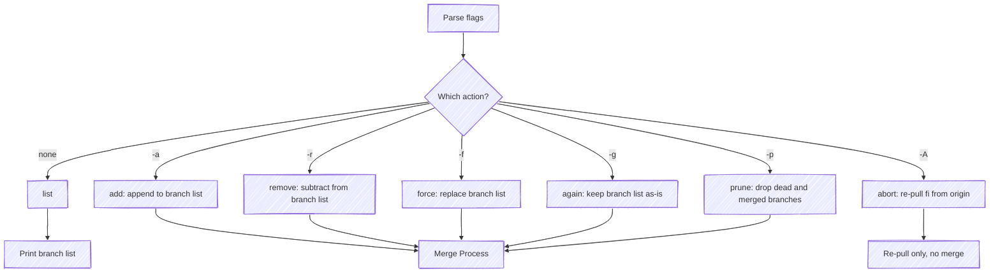

# Advanced Commands

Power-user commands for rebuilding, replacing, and maintaining the `fi` branch.

## force

Replace the entire `fi` branch list with only the specified branches. Everything else is removed.

```bash
git fi -f feature-auth
```

This is useful when `fi` has accumulated stale branches and you want a clean slate with just your branch.

### Empty fi

With no branch arguments, force removes all features from `fi`:

```bash
git fi -f
```

## again

Re-merge all branches currently in `fi` without changing the branch list.

```bash
git fi -g
```

This is the command to reach for when:

- You've force-pushed a feature branch and want `fi` to pick up the new commits
- A transient merge conflict has been resolved upstream
- You want to verify that the current set of branches still integrates cleanly

Does not accept branch arguments.

## prune

Remove branches from `fi` that no longer exist on origin (dead) or that have already been merged into the default branch.

```bash
git fi -p
```

Dead and already-merged branches are also cleaned up automatically during any merge (see [Dead Branch Pruning](#dead-branch-pruning) below); `-p` is the explicit command to tidy `fi` without otherwise changing the list. If there's nothing to prune, git-fi prints `Nothing to prune.` and makes no commit. Does not accept branch arguments.

## abort

Re-pull `origin/fi` from origin, discarding any local ref state.

```bash
git fi -A
```

Use this when your local view of `fi` has drifted from the remote (for example, someone else rebuilt it) and you want to resync. Unlike the other actions, `abort` does not run the merge process — it only re-fetches `origin/fi`. If `origin/fi` doesn't exist, git-fi aborts with `origin/fi does not exist — nothing to re-pull`. Does not accept branch arguments.

## Dead Branch Pruning

During any merge operation, git-fi automatically detects branches that no longer exist on the remote. These "dead" branches are pruned from the `fi` branch list and a warning is printed:

```text
 * origin/deleted-branch (pruned — no longer exists on origin)
```

No manual intervention is needed.

## Merged Branch Warnings

Branches that have already been merged to the default branch (`main` or `master`) are flagged during the merge process:

```text
 * origin/already-merged (warning — already merged to main)
```

These branches are still included in `fi` but the warning helps teams identify stale entries that can be removed.

## CI Mode

When running inside a CI pipeline (`CI=true`), git-fi includes pipeline context (build ID and triggering ref) in the `fi` commit message for traceability.

The typical CI use case is a post-build job that runs `git fi -g` after a successful feature branch build, keeping the integration branch continuously up to date. Since `fi` already exists by then, that job runs non-interactively. To create `fi` for the first time from a pipeline, pass `--yes` (`-y`) so the bootstrap confirmation — which otherwise needs a terminal — is skipped.

See [CI Integration](/ci-integration) for full details.

## Command Dispatch

See also `--debug` (`-d`) to watch git commands as they execute — useful for diagnosing unexpected merge behavior.



Every mutation command except `abort` feeds into the same [Merge Process](/merge-process); the only difference is how the branch list is computed before merging begins. `abort` is the exception — it re-pulls `origin/fi` without merging.
