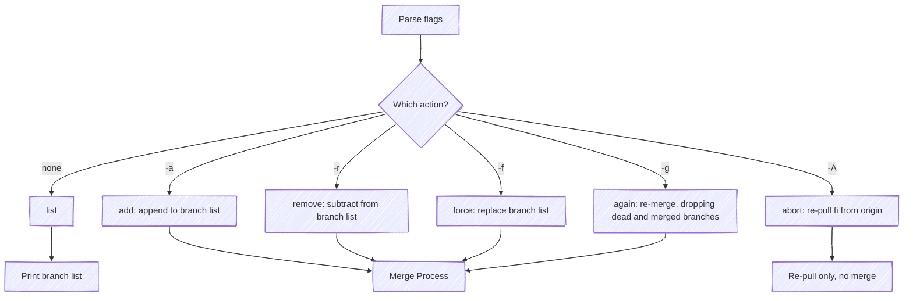

# Advanced Commands

Power-user commands for rebuilding, replacing, and maintaining the `fi` branch.

## force

Replace the entire `fi` branch list with only the specified branches. Everything else is removed.

```bash
git fi -f feature-auth
```

This is useful when `fi` has accumulated stale branches and you want a clean slate with just your branch.

### Empty fi

With no branch arguments, force removes all features from `fi`:

```bash
git fi -f
```

## again

Rebuild `fi` from the branches currently in it, on top of the current default branch.

```bash
git fi -g
```

This is the command to reach for when:

- You've force-pushed a feature branch and want `fi` to pick up the new commits
- `main` has moved and you want `fi` rebuilt on top of it
- A transient merge conflict has been resolved upstream
- You want to verify that the current set of branches still integrates cleanly
- You want to tidy `fi`, dropping branches that were deleted or have landed

That last point is the same thing as the others, not an extra mode: the [merge process](/merge-process) drops dead and already-merged branches on its way through, so re-merging is what prunes `fi`. See [Dead Branch Pruning](#dead-branch-pruning) below.

`-g` always re-merges and force-pushes, even when no branches were dropped and `main` hasn't moved. Does not accept branch arguments.

## abort

Re-pull `origin/fi` from origin, discarding any local ref state.

```bash
git fi -A
```

Use this when your local view of `fi` has drifted from the remote (for example, someone else rebuilt it) and you want to resync. Unlike the other actions, `abort` does not run the merge process — it only re-fetches `origin/fi`. If `origin/fi` doesn't exist, git-fi aborts with `origin/fi does not exist — nothing to re-pull`. Does not accept branch arguments.

## Dead Branch Pruning

During any merge operation, git-fi drops branches that no longer exist on the remote, warning on stderr as it goes:

```text
Ignoring branches that no longer exist:
  deleted-branch
```

No manual intervention is needed: the branch is gone from `fi` after that merge, because the surviving list is what gets written to the new `fi` commit message.

## Merged Branch Pruning

Branches already merged into the default branch (`main` or `master`) are dropped the same way, with their own warning:

```text
already-merged already in main
```

There's nothing left to clean up afterwards. A branch that has landed leaves `fi` on the next merge of any kind.

## CI Mode

When running inside a CI pipeline (`CI=true`), git-fi includes pipeline context (build ID and triggering ref) in the `fi` commit message for traceability.

The typical CI use case is a post-build job that runs `git fi -g` after a successful feature branch build, keeping the integration branch continuously up to date. Since `fi` already exists by then, that job runs non-interactively. To create `fi` for the first time from a pipeline, pass `--yes` (`-y`) so the bootstrap confirmation — which otherwise needs a terminal — is skipped.

See [CI Integration](/ci-integration) for full details.

## Command Dispatch

See also `--debug` (`-d`) to watch git commands as they execute — useful for diagnosing unexpected merge behavior.


```mermaid
%%{ init: { 'look': 'handDrawn' } }%%
flowchart TD
  A[Parse flags] --> B{Which action?}
  B -- none --> L[list]
  B -- -a --> ADD[add: append to branch list]
  B -- -r --> REM[remove: subtract from branch list]
  B -- -f --> FRC[force: replace branch list]
  B -- -g --> AGN[again: re-merge, dropping dead and merged branches]
  B -- -A --> ABT[abort: re-pull fi from origin]
  ADD --> M[Merge Process]
  REM --> M
  FRC --> M
  AGN --> M
  L --> OUT[Print branch list]
  ABT --> OUT2[Re-pull only, no merge]
```

Every mutation command except `abort` feeds into the same [Merge Process](/merge-process); the only difference is how the branch list is computed before merging begins. `abort` is the exception — it re-pulls `origin/fi` without merging.
