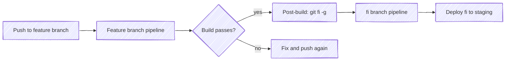

# CI Integration

git-fi can surface each branch's pipeline status from your forge alongside the branch list, and it adds pipeline context to commits when it runs inside CI.

Forge support is pluggable: git-fi detects the forge from the `origin` remote and queries that forge's API for per-branch status. **GitLab is supported today.** Other forges slot in the same way — GitHub is the obvious next one.

| Forge | Status | Enabled with |
|-------|--------|--------------|
| GitLab | Supported | `git fi --auth=login` |
| GitHub | Planned | — |

## GitLab

Store a token once per machine:

```bash
git fi --auth=login
```

It prints a link to GitLab's token form with the name and scope prefilled, reads the token from stdin (never from an argument, which `ps` can see and your shell writes to history), checks it against GitLab, and writes it to `$XDG_CONFIG_HOME/git-fi/config.json` with the directory `0700` and the file `0600`. git-fi refuses to read that file if it later becomes readable by anyone else.

git-fi only reads pipeline status, so a **`read_api`** token is all it needs. If you hand it a broader one, it stores it and tells you which extra scopes it carries.

The token is stored per host, so a self-hosted instance and `gitlab.com` can each have their own, and a repo on a host you've never logged into won't be sent a neighbour's token. To store one from outside a repository, name the host:

```bash
git fi --auth=login --host gitlab.com
```

`git fi --auth` reports which token is in effect, and `git fi --auth=logout` removes it.

Piping works too, so a password manager can supply the value:

```bash
pass show gitlab/git-fi | git fi --auth=login
```

Once a token resolves, `git fi` (list mode) shows each branch's pipeline status in a table, followed by a line for the `fi` branch's own pipeline:

```text
Branch             │ Date       │ Author │ Pipeline
───────────────────┼────────────┼────────┼──────────
feature-auth       │ 2026-03-30 │ Alice  │ 11111 ✅
feature-search ↓12 │ 2026-03-30 │ Bob    │ 22222 ⏳
fi: #12345 ⏳
```

### Status Indicators

Each pipeline's GitLab status maps to an emoji on a terminal, and to a word anywhere the emoji would land in plain text — a job log, a piped run, `--bare`, `--json`, or `NO_COLOR`. The status is the only thing in that cell, so it has to survive being read as text.

| Emoji | Plain text | GitLab status | Meaning |
|-------|------------|---------------|---------|
| ✅ | `success` | `success` | Pipeline succeeded |
| ❌ | `failed` | `failed` | Pipeline failed |
| ⏰ | `timed out` | `timeout` | Pipeline timed out |
| ⏳ | `running`, `pending` | `running`, `pending` | Pipeline running or queued |
| ➖ | `none` | `missing` | No pipeline found (or branch deleted) |
| ⏭️ | `skipped` | `skipped` | Pipeline skipped |

With no token, the list shows only a `Branch` column and the `fi:` line is omitted. A per-branch HTTP 404 (e.g. a deleted branch) is shown as `missing`; any other GitLab API error aborts with a message naming how to run without CI status, matched to where the live token came from.

### Where the token comes from

There are two sources: the token `--auth=login` stores, and a `GITLAB_ACCESS_TOKEN` environment variable.

| Context | Sources git-fi reads |
|---------|----------------------|
| Your terminal | The stored token first, then `GITLAB_ACCESS_TOKEN` |
| A CI job (`CI` set) | `GITLAB_ACCESS_TOKEN` only — the config file is not read |

In a pipeline the credential belongs to the job and arrives as a variable, so git-fi doesn't consult the config file there at all. That's stronger than ranking it second: a `config.json` that a container image happens to carry can't supply a pipeline's token even by accident. Give CI jobs the variable.

`git fi --auth` tells you which token is live, and says so explicitly when a stored token is shadowing an export.

## Output in a job log

Off a terminal, git-fi drops the animated branch display it can't animate and states the outcome once. A `git fi -g` in CI reads:

```text
re-merged fi
Branch                                                                                  │ Date       │ Author │ Pipeline
────────────────────────────────────────────────────────────────────────────────────────┼────────────┼────────┼──────────────
[feature-auth](https://gitlab.example.com/group/proj/-/compare/main...feature-auth)     │ 2026-03-30 │ Alice  │ 11111 success
[feature-search](https://gitlab.example.com/group/proj/-/compare/main...feature-search) │ 2026-03-30 │ Bob    │ 22222 running
fi: #12345 running
```

The outcome verb names the action: `added to fi`, `removed from fi`, `replaced fi`, `re-merged fi`. Everything below it is the resulting state of `fi`, so a job log is two facts deep: what happened, and which branches `fi` holds now.

On a terminal the branch name is a clickable link to that comparison and the table stays narrow. A job log can't render the escape sequence, so the reference is written out as markdown — copy a row into Slack, an issue, or an MR comment and the link works there. Pipeline IDs stay bare: carrying both URLs inline pushed the table past 200 columns, and the comparison is the one you leave the log to read.

On failure there's no outcome line. Each conflicting branch with what it conflicts with and the remedy, any untracked files the failed merge left behind, and `Aborted due to merge failures` are what you get, and the job exits non-zero. Under `--json` that attribution comes back as a `conflicts` array on stdout as well, so a job can act on it without parsing the log; `branches` is `fi` as it stands (unchanged, since nothing was pushed) and `attempted` is the set the merge tried.

One caveat for CI specifically: in a shallow clone git counts only within the fetched window, so `behind` comes back `null` and no `↓N` marker is drawn. Fetch the full history if you want the count. Already-merged detection still works, though it can miss a branch whose commits fall outside the window — it never goes the other way and drops a live branch. Add `--debug` to see the git commands, how long each took, and their stderr, which git-fi otherwise discards.

## Pipeline context in CI

When git-fi runs inside a CI pipeline (`CI=true`), commit messages include pipeline context:

```text
Re-merge fi branch triggered by build 12345 due to commit on feature-auth. Was originally: --- ...

(feature-auth, feature-search)@[a1b2c3d]
```

The variables below are GitLab CI's predefined names; a future forge integration would read that forge's equivalents.

| Variable | Purpose |
|----------|---------|
| `CI` | Detected as truthy to enable CI mode |
| `CI_PIPELINE_ID` | Included in commit message for traceability |
| `CI_COMMIT_REF_NAME` | Included in commit message for traceability |

## Typical CI Workflow

This flow is forge-agnostic — it works on any CI that can run `git fi -g` after a build.


```mermaid
%%{ init: { 'look': 'handDrawn' } }%%
flowchart LR
  A[Push to feature branch] --> B[Feature branch pipeline]
  B --> C{Build passes?}
  C -- yes --> D[Post-build: git fi -g]
  D --> E[fi branch pipeline]
  E --> F[Deploy fi to staging]
  C -- no --> G[Fix and push again]
```

1. Developer pushes to a feature branch
2. Feature branch CI pipeline runs tests
3. On success, a post-build job runs `git fi -g` to rebuild `fi`
4. The updated `fi` branch triggers its own pipeline
5. The `fi` pipeline deploys to a staging/candidate environment

This gives teams a continuously updated integration environment that reflects all in-flight work.

## Environment Variables

| Variable | Purpose |
|----------|---------|
| `GITLAB_ACCESS_TOKEN` | A GitLab token for pipeline status. Checked after a stored token, and the only source git-fi reads under `CI`; prefer `git fi --auth=login` at a terminal |
| `XDG_CONFIG_HOME` | Where the stored token lives (`<XDG_CONFIG_HOME>/git-fi/config.json`); defaults to `~/.config` |
| `GIT_FI_NO_HINTS` | Suppress hint messages at an interactive terminal. A CI job needs nothing set — git-fi suppresses hints on its own when `CI` is set or stdout isn't a terminal, since there's nobody there to act on the advice. |
| `NO_COLOR` | Disable color output (respects [no-color.org](https://no-color.org) convention) |
