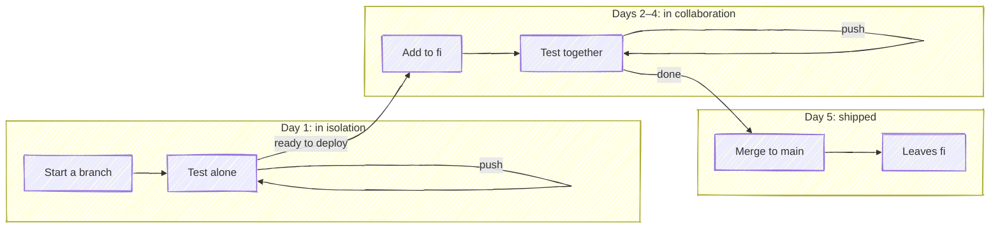

# Daily Workflow

A feature usually takes a few days. It starts in *isolation*, where its pipeline tests it alone. When it's ready to be tested in **collaboration** with the rest of the in-flight work, you add it to `fi`. Merging it to `main` ships it. This page follows one branch, `feature-search`, through that week in a repository where CI rebuilds `fi` after each build (see [CI Integration](ci-integration.md#typical-ci-workflow)). Select a step to jump to it.



## Day 1: Start in isolation

Create the branch, get to a first commit, and push it:

```bash
git switch -c feature-search
git commit -m "Add search endpoint"
git push -u origin feature-search
```

The branch's pipeline builds and tests it on its own. Keep pushing until the feature is far enough along that you'd want to see it running.

## Days 2–4: Test in collaboration

When you're ready to deploy the feature to the shared environment, add the branch to `fi`:

```bash
git fi -a
```

With no branch name, `-a` adds the branch you're on. It merges your branch with every other branch in `fi` and pushes the result, and `fi`'s pipeline deploys it to staging. From there your feature runs alongside everyone else's in-flight work, so a conflict or a broken interaction shows up now rather than at merge time. Add it from a commit whose pipeline has finished: added mid-pipeline, the branch is already in `fi` when that pipeline's post-build job rebuilds it, which starts a second `fi` pipeline for the same commits.

Keep pushing to the branch. Each push rebuilds `fi` with your new commits, so staging has them once the branch's pipeline finishes. `git fi` shows what `fi` holds and, with a GitLab token, each branch's pipeline status.

> [!TIP|label:Let CI rebuild fi]
> A post-build `git fi -g` job keeps `fi` current on every push, so nobody has to remember to rebuild it (see [Typical CI Workflow](ci-integration.md#typical-ci-workflow)). Running `git fi -g` by hand on top of it starts a second `fi` pipeline; [again](advanced.md#again) lists the cases where running it yourself is right.

If a rebuild fails, the job log names the branch at fault and what it conflicts with (see [Conflict Handling](merge-process.md#conflict-handling)):

- **Your branch conflicts with `main`:** rebase it and push. The push rebuilds `fi`.
- **Your branch conflicts with one already in `fi`:** talk to that branch's author about how the two changes fit together, then adjust yours and push.
- **Someone's branch is blocking `fi` or breaking staging:** [remove](commands.md#remove) it so everyone else can keep testing, and send its author the message git-fi printed.

## Day 5: Ship it

Merge the branch to `main` through your PR or MR. `main`'s pipeline rebuilds `fi`, and the rebuild drops branches that are [already merged](advanced.md#merged-branch-pruning), so `feature-search` leaves `fi` without a `git fi -r`. Until then, `git fi` lists it as `merged`.
