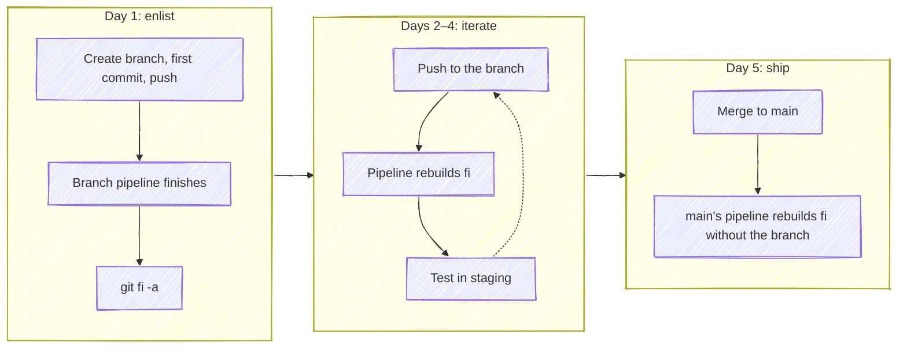

# Daily Workflow

A feature usually takes a few days: scope it and get to a first commit, iterate, then ship. This page follows one branch, `feature-search`, through that week in a repository where CI runs `git fi -g` after each build (see [CI Integration](ci-integration.md#typical-ci-workflow)).



## Day 1: Scope the work and enlist

Create the branch, get to a first commit, and push it:

```bash
git switch -c feature-search
git commit -m "Add search endpoint"
git push -u origin feature-search
```

Once the branch's pipeline finishes, add it to `fi`:

```bash
git fi -a
```

With no branch name, `-a` adds the branch you're on. It rebuilds `fi` and pushes it, which starts a `fi` pipeline. Waiting for the branch pipeline first is what keeps that to one: added while its pipeline is still running, the branch is in `fi` by the time the pipeline finishes, so the post-build job starts a second `fi` pipeline for the same commits.

## Days 2–4: Iterate

Keep pushing to the branch. Each push runs the branch pipeline, and its post-build job rebuilds `fi` with your new commits and deploys it to staging, alongside everyone else's in-flight work. When you want to try the feature in the integrated environment, it's already there once that pipeline finishes. `git fi` shows what `fi` holds and, with a GitLab token, each branch's pipeline status.

The push is the rebuild, so there's no `git fi -g` to run. A manual one on top starts a second `fi` pipeline. [again](advanced.md#again) lists the cases where running it yourself is right.

If a rebuild fails, the job log names the branch at fault and what it conflicts with (see [Conflict Handling](merge-process.md#conflict-handling)):

- **Your branch conflicts with `main`:** rebase it and push. The push rebuilds `fi`.
- **Your branch conflicts with one already in `fi`:** talk to that branch's author about how the two changes fit together, then adjust yours and push.
- **Someone's branch is blocking `fi` or breaking staging:** [remove](commands.md#remove) it so everyone else can keep testing, and send its author the message git-fi printed.

## Day 5: Ship it

Merge the branch to `main` through your PR or MR. `main`'s pipeline rebuilds `fi`, and the rebuild drops branches that are [already merged](advanced.md#merged-branch-pruning), so `feature-search` leaves `fi` without a `git fi -r`. Until then, `git fi` lists it as `merged`.
