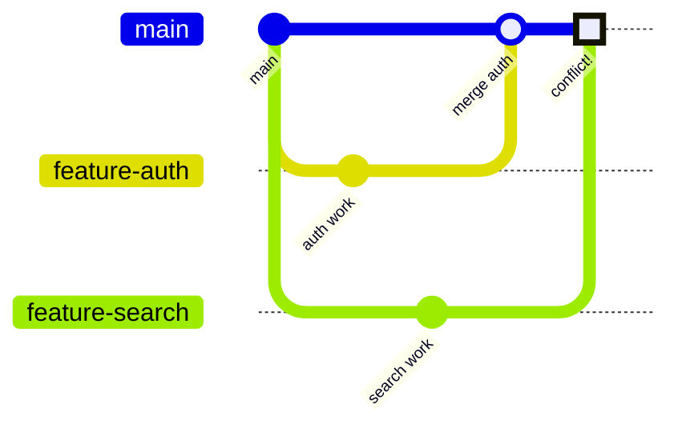
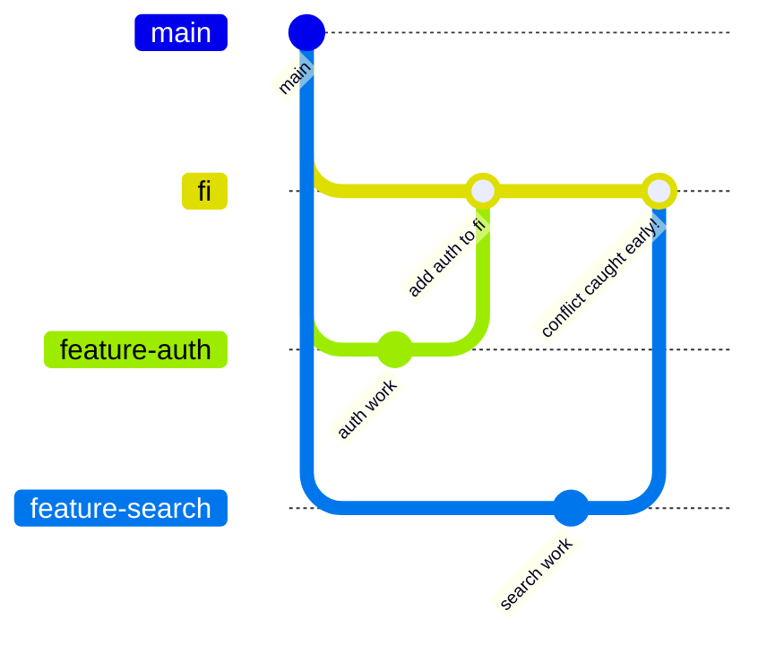
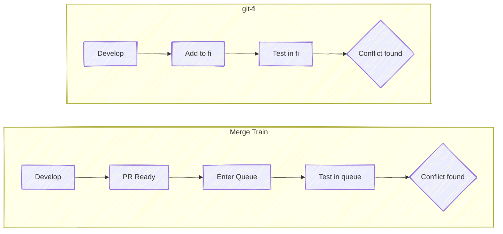
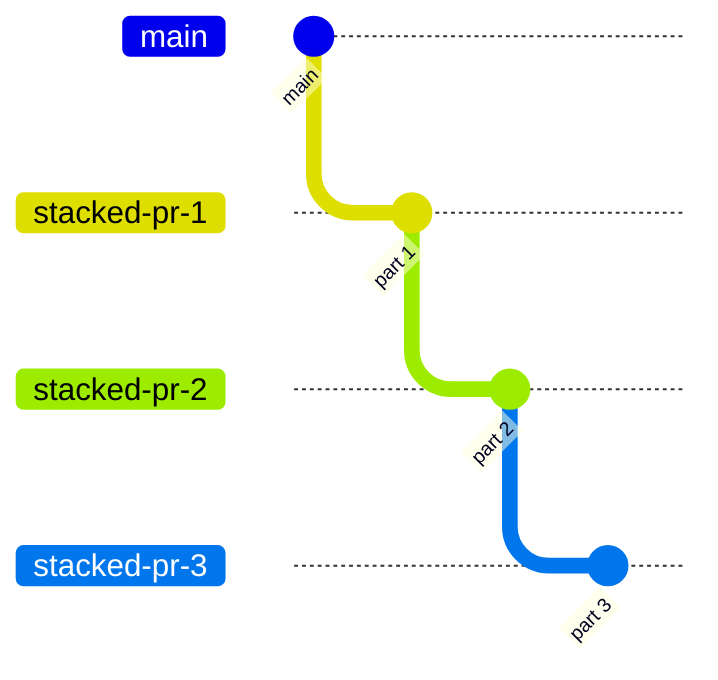
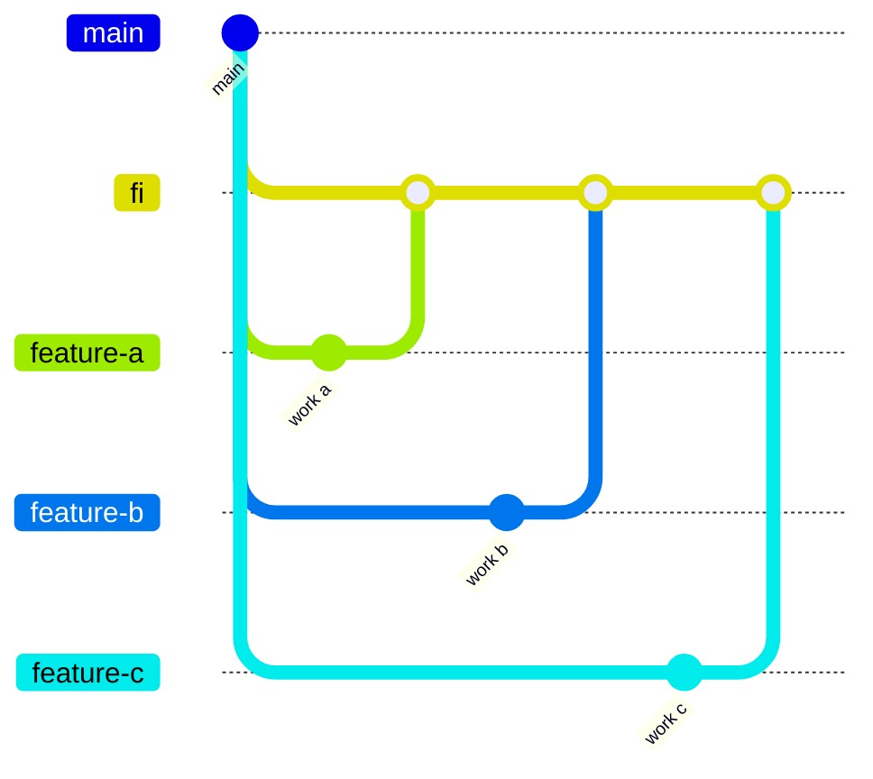

# git-fi

A git plugin that maintains a temporary integration branch named `fi`. Merge multiple in-progress feature branches together to detect conflicts early and test features in collaboration — before they land on `main`.

## The Problem

Feature branches keep work isolated, but isolation is also the problem. Two features that each pass their own tests can still conflict when combined. You don't find out until one merges to `main` — and by then the other has diverged further.



Two developers work on separate features that both touch `routes.ts`. Auth merges first. Search tries to merge the next day and hits conflicts that could have been caught days earlier — if the branches had been tested together while both were still in flight.

## The Solution

git-fi creates a throwaway integration branch where work-in-progress meets early. The `fi` branch is ephemeral — rebuilt from scratch on every operation — so it never interferes with your real branches or with `main`.



Teams use `fi` to:
- **Test-drive** features together before they're ready to merge
- **Detect conflicts** between in-flight work before they reach `main`
- **Deploy combinations** of features to a staging environment for validation

When your team has a finite number of pre-production environments — one staging server, one QA box — `fi` replaces the mutex. Instead of deploying one feature branch at a time while others wait, `fi` combines them so the environment serves all in-flight work simultaneously.

## Quick Example

```bash
git fi                # see what's in fi
git fi -a my-feature  # add your branch
git fi -r my-feature  # remove it when done
git fi -g             # rebuild fi with the same branches
```

## How git-fi Compares

git-fi is not the only approach to integration pain. Here is how it relates to techniques you may already use.

### vs. Traditional CI/CD

```mermaid
%%{ init: { 'look': 'handDrawn' } }%%
flowchart TD
  subgraph traditional["Traditional CI"]
    direction LR
    T1[feature A] --> T2[test ✓] --> T3[merge to main ✓]
    T4[feature B] --> T5[test ✓] --> T6[merge to main ✗]
    T6 -.-> T4
  end
  subgraph gitfi["With git-fi"]
    direction LR
    subgraph features[" "]
      direction TB
      F1[feature A]
      F2[feature B]
    end
    features --> F3[fi]
    F3 --> F4[test ✗]
    F4 -.-> features
  end
  traditional ~~~ gitfi
  style T6 fill:#5c1a1a,stroke:#FF5252,stroke-width:2px,color:#FF5252
  style F4 fill:#4a2800,stroke:#FF9800,stroke-width:2px,color:#FF9800
  style gitfi fill:#1a1a2e,stroke:#6F43D6,stroke-width:2px
```



With [traditional CI](https://martinfowler.com/articles/continuousIntegration.html), integration issues surface after merging to `main`. With git-fi, they surface before — while the work is still in progress and easier to fix.

### vs. Merge Trains

[GitLab merge trains](https://docs.gitlab.com/ee/ci/pipelines/merge_trains.html) and [GitHub merge queues](https://docs.github.com/en/repositories/configuring-branches-and-merges-in-your-repository/configuring-pull-request-merges/managing-a-merge-queue) serialize merges to `main` by testing each PR against the combined state of all PRs ahead of it in the queue.

| | Merge Trains | git-fi |
|---|---|---|
| **Goal** | Safe merge to main | Early conflict detection |
| **Timing** | At merge time | During development |
| **Scope** | PRs ready to merge | Any in-flight branch |
| **Branch** | Temporary per-train | Single persistent `fi` |
| **Automation** | Fully automated | Developer-driven |



A PR passes all checks on its own branch. Another PR merges to `main`. The first PR now has an integration bug that only appears when both changes coexist. Merge trains catch this at merge time; git-fi catches it during development. They are complementary — git-fi for early feedback, merge trains for safe landing.

### vs. Stacked PRs

Tools like [Graphite](https://graphite.com/guides/stacked-diffs), [ghstack](https://github.com/ezyang/ghstack), and [spr](https://github.com/ejoffe/spr) manage chains of dependent PRs that build on each other.

| | Stacked PRs | git-fi |
|---|---|---|
| **Relationship** | Linear dependency chain | Independent branches |
| **Conflict model** | Each PR against its parent | All branches merged together |
| **Use case** | Large features split into reviewable chunks | Multiple independent features tested together |

**Stacked PRs:**



**git-fi:**



Stacked PRs solve "this PR is too big." git-fi solves "these PRs don't know about each other."

### vs. Feature Flags

[Feature flags](https://martinfowler.com/articles/feature-toggles.html) allow incomplete features to exist in `main` behind runtime toggles.

| | Feature Flags | git-fi |
|---|---|---|
| **Isolation** | Runtime (deploy-time) | Branch-time |
| **Merge timing** | Merge early, toggle off | Merge late, test early via fi |
| **Complexity** | Flag management, cleanup | Branch management |
| **Risk** | Flag leaks, stale flags | Merge conflicts |

Feature flags and git-fi address the same tension from opposite directions. If feature flags already handle your isolation needs, you may not need git-fi.

### vs. Trunk-Based Development

[Trunk-based development](https://trunkbaseddevelopment.com/) advocates short-lived branches (or no branches at all) with frequent merges to `main`. git-fi bridges the gap for teams that aren't ready to go fully trunk-based — providing early integration and a shared view of combined in-flight work while keeping `main` stable. If your branches are already short-lived enough, git-fi adds little value.

## When git-fi Fits

- You have a limited number of pre-production environments and multiple teams need to deploy to them concurrently
- Multiple developers work on features that touch overlapping code
- You deploy from an integration or staging branch before merging to `main`
- Your team uses feature branches but wants earlier integration feedback
- Merge trains or merge queues aren't available or are too heavyweight for your workflow

A team has one staging environment and three features in flight. Without git-fi, staging is a mutex: one branch deploys, the others wait. With git-fi, all three merge into `fi`, deploy together, and get tested in parallel on the same environment.

git-fi is less useful when you practice trunk-based development with very short-lived branches, when feature flags handle all your isolation needs, or when only one developer works on the codebase at a time.

## Next Steps

- [Quick Start](/quickstart) — install and run your first command
- [Basic Commands](/commands) — list, add, remove, and interactive select
- [Advanced Commands](/advanced) — force, again, pruning, and CI mode
