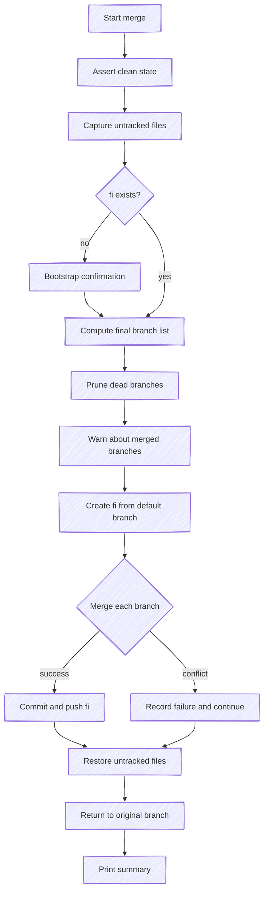

# Merge Process

Every mutation command (`-a`, `-r`, `-f`, `-g`) triggers the same merge process. git-fi rebuilds the `fi` branch from scratch each time — it never amends or cherry-picks onto an existing `fi`.

## Flow



## Step by Step

### 1. Clean state

git-fi asserts that the working tree has no uncommitted changes. This protects your work from being lost during branch switching.

### 2. Untracked files

Untracked files are captured before the merge starts. If the merge fails, git-fi prints `rm` commands to clean up any untracked files that were created during the process.

### 3. Bootstrap confirmation

The first time `fi` is created in a repository, git-fi asks for confirmation:

```text
No fi branch detected. Create one? [y/n]
```

In CI mode (`CI=true`), this prompt is skipped and `fi` is created automatically.

### 4. Branch list computation

The final branch list depends on the command:

| Command | Result |
|---------|--------|
| `-a` | Current branches + new branches |
| `-r` | Current branches - removed branches |
| `-f` | Only the specified branches |
| `-g` | Current branches (unchanged) |

### 5. Dead branch pruning

Branches that no longer exist on the remote are automatically removed from the list. git-fi warns when this happens.

### 6. Merged branch warnings

Branches that have already been merged to the default branch are flagged with a warning. They're still included in `fi` but the warning helps teams clean up stale entries.

### 7. Merge execution

git-fi creates a fresh `fi` branch from `origin/main` (or `origin/master`), then merges each branch sequentially. If a branch fails to merge:

- The conflict is recorded
- The merge is aborted
- The remaining branches continue

This means a single conflicting branch doesn't block the rest.

### 8. Commit and push

The resulting merge is committed with a message that records the branches included in `fi`, so the list round-trips on the next run. git-fi currently writes the **legacy** standard git merge message:

```text
Merge remote-tracking branches 'origin/feature-auth', 'origin/feature-search' and 'origin/bugfix-nav' into fi
```

git-fi also *reads* a compact **terse** format (`(feature-auth, feature-search, bugfix-nav)@[a1b2c3d]`), so `fi` branches written by other versions are still understood; it will switch to *writing* terse after the migration rollout. The `fi` branch is then force-pushed to origin.

### 9. Summary

After completion, git-fi prints a summary:

```text
== SUMMARY ==
 * feature-auth
 * feature-search
 * bugfix-nav
```

If any branches failed to merge, they're listed separately:

```text
FAILED:
 * feature-broken
```

## Conflict Handling

When a branch conflicts during the merge:

1. The merge is aborted (`git merge --abort`)
2. The branch is added to the failure list
3. Remaining branches are still merged
4. The final `fi` branch contains all successful merges
5. Failed branches are reported in the summary

This non-blocking approach means one bad branch doesn't prevent the rest of the team from using `fi`.
