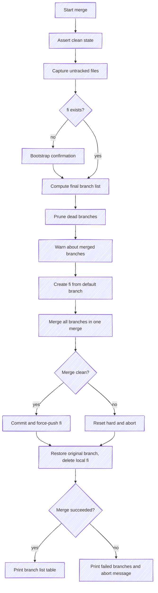

# Merge Process

Every mutation command (`-a`, `-r`, `-f`, `-g`) triggers the same merge process. git-fi rebuilds the `fi` branch from scratch each time — it never amends or cherry-picks onto an existing `fi`.

## Flow



## Step by Step

### 1. Clean state

git-fi asserts that the working tree has no uncommitted changes. This protects your work from being lost during branch switching.

### 2. Untracked files

Untracked files are captured before the merge starts. If the merge fails, git-fi prints `rm` commands to clean up any untracked files that were created during the process.

### 3. Bootstrap confirmation

The first time `fi` is created in a repository, git-fi asks for confirmation:

```text
No fi branch detected. Create one? [y/n]
```

In CI mode (`CI=true`), this prompt is skipped and `fi` is created automatically.

### 4. Branch list computation

The final branch list depends on the command:

| Command | Result |
|---------|--------|
| `-a` | Current branches + new branches |
| `-r` | Current branches - removed branches |
| `-f` | Only the specified branches |
| `-g` | Current branches (unchanged) |

### 5. Dead branch pruning

Branches that no longer exist on the remote are automatically removed from the list. git-fi warns when this happens.

### 6. Merged branch warnings

Branches that have already been merged to the default branch are flagged with a warning. They're still included in `fi` but the warning helps teams clean up stale entries.

### 7. Merge execution

git-fi creates a fresh `fi` branch from `origin/main` (or `origin/master`), then merges **all** the branches together in a single `git merge --no-commit --no-ff`. It's all-or-nothing:

- If every branch integrates cleanly, git-fi commits and force-pushes `fi`.
- If **any** branch conflicts, git-fi resets the working tree (`git reset --hard`) and aborts. No `fi` is pushed — the remote is left untouched.

Because the branches are merged in one combined merge, git can't attribute a conflict to a single branch, so a failure reports the whole set it was merging (see [Conflict Handling](#conflict-handling)).

### 8. Commit and push

The resulting merge is committed with a message that records the branches included in `fi`, so the list round-trips on the next run. git-fi currently writes the **legacy** standard git merge message:

```text
Merge remote-tracking branches 'origin/feature-auth', 'origin/feature-search' and 'origin/bugfix-nav' into fi
```

git-fi also *reads* a compact **terse** format (`(feature-auth, feature-search, bugfix-nav)@[a1b2c3d]`), so `fi` branches written by other versions are still understood; it will switch to *writing* terse after the migration rollout. The `fi` branch is then force-pushed to origin.

### 9. Output

On success, git-fi prints the branch list table (identical to `list` output, including the `fi` pipeline line when `GITLAB_ACCESS_TOKEN` is set), so you see the final state without running a separate command:

```text
Branch         │ Date       │ Author │ Pipeline
───────────────┼────────────┼────────┼──────────
feature-auth   │ 2026-03-30 │ Alice  │ 11111 ✅
feature-search │ 2026-03-30 │ Bob    │ 22222 ✅
```

On failure, git-fi prints the branches it was merging and aborts without pushing:

```text
Failed trying to merge branch(es):

 * feature-auth
 * feature-search

Aborted due to merge failures
```

## Conflict Handling

All selected branches are merged together in one `git merge`, which git treats atomically — either every branch integrates or none does. So when any branch conflicts:

1. The merge is aborted and the working tree is reset (`git reset --hard`).
2. git-fi lists the branches it was trying to merge. Because it's a combined merge, git can't single out which branch caused the conflict, so the whole set is reported.
3. Any untracked files created by the failed merge are listed with `rm` commands to remove them.
4. git-fi restores your original branch, deletes the local `fi`, and exits with `Aborted due to merge failures`. **No `fi` is pushed** — the remote stays as it was.

To get a clean `fi` again, drop the offending branch (`git fi -r <branch>`) or resolve the conflict on the feature branch and re-run (`git fi -g`).
