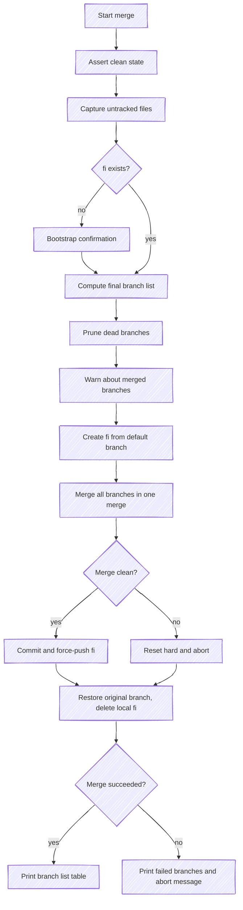

# Merge Process

Every mutation command (`-a`, `-r`, `-f`, `-g`) triggers the same merge process. git-fi rebuilds the `fi` branch from scratch each time — it never amends or cherry-picks onto an existing `fi`.

## Flow


```mermaid
%%{ init: { 'look': 'handDrawn' } }%%
flowchart TD
  A[Start merge] --> B[Assert clean state]
  B --> C[Capture untracked files]
  C --> D{fi exists?}
  D -- no --> E[Bootstrap confirmation]
  E --> F[Compute final branch list]
  D -- yes --> F
  F --> G[Prune dead branches]
  G --> H[Warn about merged branches]
  H --> I[Create fi from default branch]
  I --> J[Merge all branches in one merge]
  J --> K{Merge clean?}
  K -- yes --> L[Commit and force-push fi]
  K -- no --> M[Reset hard and abort]
  L --> N[Restore original branch, delete local fi]
  M --> N
  N --> O{Merge succeeded?}
  O -- yes --> P[Print branch list table]
  O -- no --> Q[Print failed branches and abort message]
```

## Step by Step

### 1. Clean state

git-fi asserts that the working tree has no uncommitted changes. This protects your work from being lost during branch switching.

### 2. Untracked files

Untracked files are captured before the merge starts. If the merge fails, git-fi prints `rm` commands to clean up any untracked files that were created during the process.

### 3. Bootstrap confirmation

The first time `fi` is created in a repository, git-fi asks for confirmation:

```text
No fi branch detected. Create one? [y/n]
```

In CI mode (`CI=true`), this prompt is skipped and `fi` is created automatically.

### 4. Branch list computation

The final branch list depends on the command:

| Command | Result |
|---------|--------|
| `-a` | Current branches + new branches |
| `-r` | Current branches - removed branches |
| `-f` | Only the specified branches |
| `-g` | Current branches (unchanged) |

Steps 5 and 6 then filter that list, so the set that actually gets merged can be smaller than the table suggests.

### 5. Dead branch pruning

Branches that no longer exist on the remote are removed from the list, with a warning:

```text
Ignoring branches that no longer exist:
  deleted-branch
```

### 6. Merged branch pruning

Branches already merged into the default branch are dropped from the list too, with a warning:

```text
landed-branch already in main
```

Both filters apply to every command, so any mutation tidies `fi` on the way through. `-g` with no other change is therefore the way to prune: it re-merges what's left after both filters. Since the surviving list is what gets written to the new `fi` commit message, a dropped branch is gone from `fi` afterwards, not merely flagged.

### 7. Merge execution

git-fi creates a fresh `fi` branch from `origin/main` (or `origin/master`), then merges **all** the branches together in a single `git merge --no-commit --no-ff`. It's all-or-nothing:

- If every branch integrates cleanly, git-fi commits and force-pushes `fi`.
- If **any** branch conflicts, git-fi resets the working tree (`git reset --hard`) and aborts. No `fi` is pushed — the remote is left untouched.

The combined merge can't say which branch caused a conflict, so a failure is followed by a second pass that can — see [Conflict Handling](#conflict-handling).

### 8. Commit and push

The resulting merge is committed with a message that records the branches included in `fi`, so the list round-trips on the next run. git-fi currently writes the **legacy** standard git merge message:

```text
Merge remote-tracking branches 'origin/feature-auth', 'origin/feature-search' and 'origin/bugfix-nav' into fi
```

git-fi also *reads* a compact **terse** format (`(feature-auth, feature-search, bugfix-nav)@[a1b2c3d]`), so `fi` branches written by other versions are still understood; it will switch to *writing* terse after the migration rollout. The `fi` branch is then force-pushed to origin.

### 9. Output

On success, git-fi prints the branch list table (identical to `list` output, including the `fi` pipeline line when a GitLab token is configured), so you see the final state without running a separate command:

```text
Branch         │ Date       │ Author │ Pipeline
───────────────┼────────────┼────────┼──────────
feature-auth   │ 2026-03-30 │ Alice  │ 11111 ✅
feature-search │ 2026-03-30 │ Bob    │ 22222 ✅
```

On failure, git-fi names each branch that couldn't be merged, what stopped it, and the remedy, then aborts without pushing:

```text
Failed trying to merge branch(es):

 * feature-auth (alice@example.com)  conflicts with main
     * src/config.ts
     git checkout feature-auth && git rebase origin/main && git push --force-with-lease
 * feature-search (bob@example.com)  conflicts with feature-nav (cara@example.com)
     * src/routes.ts
     rebase feature-search onto feature-nav (or the reverse) and settle the overlap there

Or temporarily remove them from fi — the conflict comes back when they do:
  git fi -r feature-auth feature-search

Aborted due to merge failures
```

Each branch carries the email of whoever last moved it, so the report says who owns the fix. git records no branch owner, so that's the tip commit's author — a bot-pushed tip reports the bot.

The `git fi -r <branch>...` line at the end names only the branches `fi` actually holds. One that failed on the way *in* was never added, so there is nothing to remove and it is left out; where none of the failing branches is in `fi`, the line is omitted entirely.

## Conflict Handling

All selected branches are merged together in one `git merge`, which git treats atomically — either every branch integrates or none does. That merge can tell you the set failed but not who is responsible, so git-fi follows it with a second pass that re-merges the list one branch at a time using `git merge-tree`, which reads the object database without touching your working tree.

That pass answers the question the bare list of failed branches doesn't:

- **A branch conflicts with `main`.** `main` has moved somewhere the branch also changed. Its owner rebases and re-pushes; nobody else is involved.
- **A branch conflicts with a peer.** Two in-flight branches overlap. This is what `fi` exists to surface — the conflict is real and would have surfaced at release time instead. The two owners settle it now, while both branches are still small.

Sometimes the pass names nobody, and says so. The combined merge uses git's octopus strategy, which does not detect renames, while the replay uses the newer engine, which does — so a branch that renames a file and a branch that edits it will fail the combined merge and come back clean from every individual probe. The report says the conflict is in the combination rather than leaving you with an unexplained list.

So when any branch conflicts:

1. The merge is aborted and the working tree is reset (`git reset --hard`).
2. git-fi attributes each failing branch and prints the remedy it calls for, with the conflicted paths.
3. Any untracked files created by the failed merge are listed with `rm` commands to remove them.
4. git-fi restores your original branch, deletes the local `fi`, and exits with `Aborted due to merge failures`. **No `fi` is pushed** — the remote stays as it was.

Reach for the named remedy before either escape hatch, and never for `git fi -f <your-branch>`. Forcing `fi` to hold only your branch clears the error by throwing away everyone else's integration, and the conflict it was reporting is still there the next time someone adds their branch back. The `git fi -r` line the report prints is the survivable version — it drops only the branches that failed and leaves everyone else's work in `fi` — but it still just defers the conflict to whenever those branches go back in.
