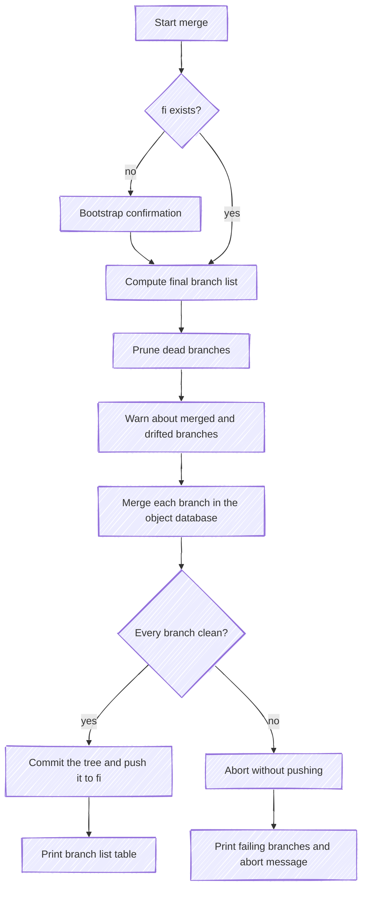

# Merge Process

Every mutation command (`-a`, `-r`, `-f`, `-g`) triggers the same merge process. git-fi rebuilds the `fi` branch from scratch each time — it never amends or cherry-picks onto an existing `fi`.

## Flow


```mermaid
%%{ init: { 'look': 'handDrawn' } }%%
flowchart TD
  A[Start merge] --> B{fi exists?}
  B -- no --> C[Bootstrap confirmation]
  C --> D[Compute final branch list]
  B -- yes --> D
  D --> E[Prune dead branches]
  E --> F[Warn about merged and drifted branches]
  F --> G[Merge each branch in the object database]
  G --> H{Every branch clean?}
  H -- yes --> I[Commit the tree and push it to fi]
  H -- no --> J[Abort without pushing]
  I --> K[Print branch list table]
  J --> L[Print failing branches and abort message]
```

## Step by Step

Nothing below reads or writes your working tree, your index, or `HEAD`. A half-finished edit, a staged file, scratch output: all of it stays exactly as it is, and none of it stands in the way of a merge. The whole operation happens in the object database, so there is nothing to undo if it fails and nothing to unwind if you interrupt it.

### 1. Bootstrap confirmation

The first time `fi` is created in a repository, git-fi asks for confirmation:

```text
No fi branch detected. Create one? [y/n]
```

In CI mode (`CI=true`), this prompt is skipped and `fi` is created automatically.

### 2. Branch list computation

The final branch list depends on the command:

| Command | Result |
|---------|--------|
| `-a` | Current branches + new branches |
| `-r` | Current branches - removed branches |
| `-f` | Only the specified branches |
| `-g` | Current branches (unchanged) |

Steps 3 and 4 then filter that list, so the set that actually gets merged can be smaller than the table suggests.

### 3. Dead branch pruning

Branches that no longer exist on the remote are removed from the list, with a warning:

```text
Ignoring branches that no longer exist:
  deleted-branch
```

### 4. Merged branch pruning

Branches already merged into the default branch are dropped from the list too, with a warning:

```text
landed-branch already in main
```

Both filters apply to every command, so any mutation tidies `fi` on the way through. `-g` with no other change is therefore the way to prune: it re-merges what's left after both filters. Since the surviving list is what gets written to the new `fi` commit message, a dropped branch is gone from `fi` afterwards, not merely flagged.

### 5. Local drift

`fi` is built from `origin/<branch>`, never from your checkout. When you name a branch whose local copy has drifted from its remote, git-fi says so:

```text
fi merges origin/feature-auth, and your feature-auth is 2 ahead, 3 behind
```

*Ahead* is the one that costs you something: those commits are only in your checkout, so nothing integrates them and `fi` says nothing about how they land. Push them and re-run. *Behind* means the opposite: `fi` has integrated a newer `feature-auth` than the one you're looking at.

Only branches you name are checked. `-g` re-merges the whole list without being a statement about any one branch, so it stays quiet rather than reporting every stale local copy of a teammate's branch. A branch you have no local copy of has nothing to drift, a local branch sharing no history with the remote one has no drift to count (a recreated branch, say), and a shallow clone counts against a truncated history, so none of the three says anything.

### 6. Merge execution

Starting from `origin/main` (or `origin/master`), git-fi merges the branches one at a time with `git merge-tree --write-tree`, committing each clean step so the next branch has something to merge onto. It's all-or-nothing:

- If every branch integrates cleanly, git-fi commits the resulting tree and force-pushes it to `fi`.
- If **any** branch conflicts, git-fi aborts. No `fi` is pushed, and the remote is left untouched.

Because each step names the branch it was merging, a failure already knows who is responsible (see [Conflict Handling](#conflict-handling)).

### 7. Commit and push

The resulting tree is committed with `git commit-tree`, taking `origin/main` and each merged branch as its parents (the same shape a merge commit has), and a message that records the branches included in `fi`, so the list round-trips on the next run. git-fi currently writes the **legacy** standard git merge message:

```text
Merge remote-tracking branches 'origin/feature-auth', 'origin/feature-search' and 'origin/bugfix-nav' into fi
```

git-fi also *reads* a compact **terse** format (`(feature-auth, feature-search, bugfix-nav)@[a1b2c3d]`), so `fi` branches written by other versions are still understood; it will switch to *writing* terse after the migration rollout. That commit is reachable from nothing local, so it is force-pushed to origin by its sha.

### 8. Output

On success, git-fi prints the branch list table (identical to `list` output, including the `fi` pipeline line when a GitLab token is configured), so you see the final state without running a separate command:

```text
Branch         │ Date       │ Author │ Pipeline
───────────────┼────────────┼────────┼──────────
feature-auth   │ 2026-03-30 │ Alice  │ 11111 ✅
feature-search │ 2026-03-30 │ Bob    │ 22222 ✅
```

On failure, git-fi names each branch that couldn't be merged and what stopped it, gives you a message to send its authors, then aborts without pushing:

```text
Failed trying to merge branch(es):

 * feature-auth (alice@example.com)  conflicts with main
     * config.ini
     Message Alice Ng <alice@example.com>:
       hey Alice, feature-auth couldn't merge into web/app@fi; main changed the same lines in config.ini:
         <<<<<<< origin/main
         timeout = 10
         ||||||| 0c5cabe
         timeout = 30
         =======
         timeout = 60
         >>>>>>> origin/feature-auth
       To fix:
       1. git checkout feature-auth && git pull && git rebase origin/main
       2. resolve the conflict, then git rebase --continue
       3. git push --force-with-lease

 * feature-search (bob@example.com)  conflicts with feature-nav (cara@example.com)
     * routes.ts
     Message Bob Li <bob@example.com>:
       hey Bob, feature-search couldn't merge into web/app@fi: feature-nav (Cara Diaz) already changes routes.ts, and feature-search's change to the same lines conflicts with it:
         <<<<<<< origin/feature-nav
           "/nav",
         ||||||| 0c5cabe
           "/search",
         =======
           "/search?q",
         >>>>>>> origin/feature-search
       To fix: talk to Cara about how the two changes should fit together.

────────────────────────────────────────
To get fi building again now, take the failing branches out:
  git fi -r feature-auth feature-search
Then send the messages above, so they can be fixed and added back.

Aborted due to merge failures
```

The authors of the conflicting branches are the ones who can resolve it, so each message is ready to paste into chat. It names the branch, the project from your origin URL, the first conflicting hunk (with the merge base between the two sides), and what to do. A branch that's yours has nobody to message, so you get the commands on their own.

A conflict with a branch you're adding gets no message: fitting it in is yours. The output names the conflicting paths, the other branch and its author, and the first hunk, then gives you the fix. It ends with the command to run again once your branches merge, naming every branch you were adding, since a failed merge adds none of them.

Each branch carries the name and email of the author of its latest commit. git records no branch owner, so a branch whose latest commit came from a bot names the bot.

When several failing branches collide with the same branch, they're listed first and together: one conversation with that branch's author clears all of them.

The `git fi -r <branch>...` line at the end names only the branches `fi` actually holds. One that failed on the way *in* was never added, so there is nothing to remove and it is left out; where none of the failing branches is in `fi`, the line is omitted entirely.

## Conflict Handling

Merging one branch at a time means the failing step names the branch, and git-fi then asks what that branch is actually fighting with: against the default branch alone, then against each branch already in the set. The result answers the question a bare list of failed branches doesn't:

- **A branch conflicts with `main`.** `main` has moved somewhere the branch also changed. Its owner rebases and re-pushes; nobody else is involved.
- **A branch conflicts with a peer.** Two in-flight branches change the same lines. This is what `fi` exists to surface: the conflict is real and would have surfaced at release time instead. Keeping a branch mergeable into `main` is its author's job, with or without `fi`. `fi` merges branches in the order they were added, so the one that failed is the later arrival, and its author adjusts it after talking to the other author about how the two changes should fit together. If the failing branch is yours, the message is a heads-up to the other author instead. If you're adding the failing branch, there's no message: reworking it is yours.
- **A branch conflicts only with the combination.** It merges cleanly against `main` and against every peer on its own, and fails only against the whole set. The output names the set.

A failing branch is left out of the accumulated set and the walk carries on, so one bad branch doesn't condemn every branch listed after it, and the output names all of them in one run.

So when any branch conflicts:

1. git-fi prints a message for each failing branch's authors, with the conflicted paths and the first conflicting hunk.
2. It exits with `Aborted due to merge failures`. **No `fi` is pushed**: the remote stays as it was, and so does your checkout.

The `git fi -r` line gets `fi` building again for everyone else right away. Send the messages at the same time, so the authors can fix their branches and get them back into testing. `git fi -f <your-branch>` is never the answer: it clears the error by throwing away everyone else's integration.
